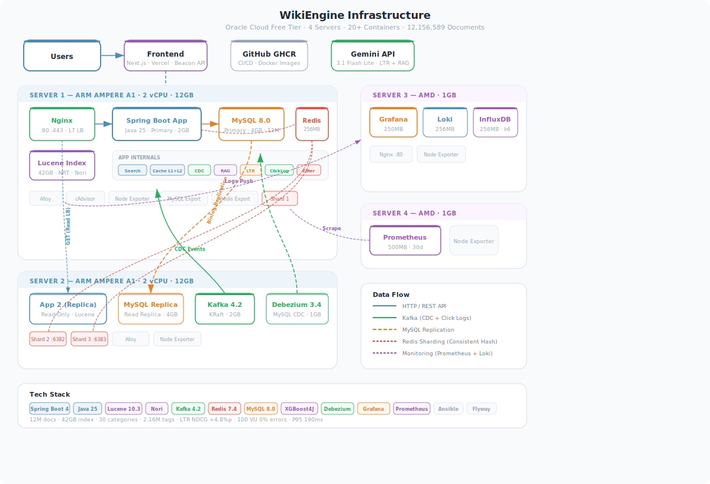
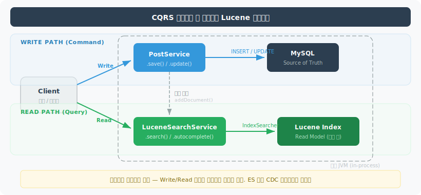
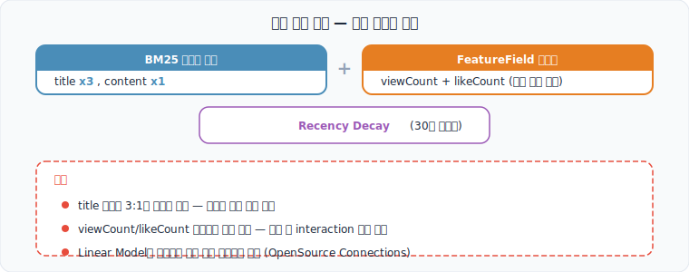
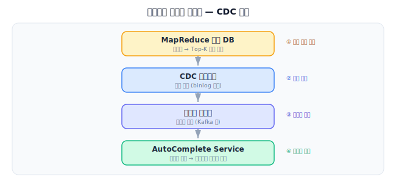
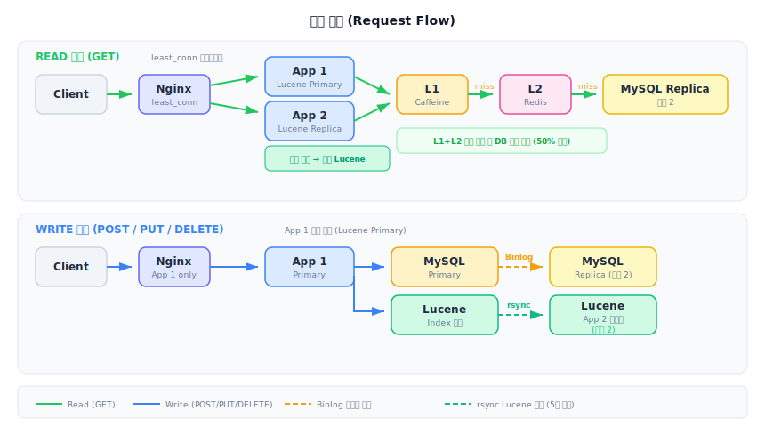
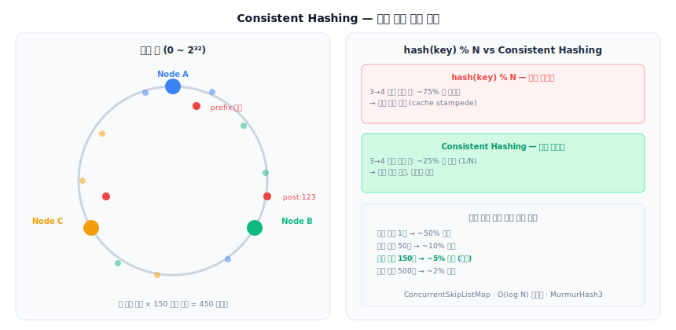

# WikiEngine

나무위키, 한국어/영어 위키백과, 뉴스, 웹텍스트 등 6개 공개 데이터셋에서 수집한 **12,156,589건**의 문서를 대상으로 한 검색 엔진입니다.

위키 문서를 그대로 사용하지 않고, 실제 커뮤니티 게시판처럼 변환하여 적재했습니다. 단순히 "검색 기능을 만들었다"가 아니라, **가장 느린 상태에서 시작하여 병목이 드러날 때마다 다음 기술로 전환**하는 과정 전체를 기록한 프로젝트입니다.

> **Live**: [studywithtymee.com](https://studywithtymee.com)

---

## Architecture



---

## Tech Stack

| 구분 | 기술 |
|------|------|
| **Backend** | Spring Boot 4.0.1 · Java 25 · Spring Modulith 2.0.2 |
| **Search** | Lucene 10.3.2 · Nori 한국어 형태소 분석 · XGBoost4J LTR |
| **Database** | MySQL 8.0 (Primary-Replica) · Flyway |
| **Cache** | Caffeine (L1) + Redis 7.4 (L2) · Consistent Hashing 3-Shard |
| **Messaging** | Kafka 4.2 (KRaft) · Debezium 3.4 CDC |
| **AI** | Google Gemini 3.1 Flash Lite · Spring AI (RAG 검색 요약) |
| **Frontend** | Next.js · Vercel |
| **Infra** | OCI Free Tier ARM · Docker · Ansible · Nginx L7 LB |
| **Monitoring** | Prometheus · Grafana · Loki · Alloy · cAdvisor · k6 |
| **CI/CD** | GitHub Actions · GHCR |

---

## Data Sources

모든 데이터는 HuggingFace 및 Wikimedia의 공개 데이터셋입니다.

| 소스 | 건수 | 출처 |
|------|------|------|
| 나무위키 (2021.03) | 571,364 | `Bingsu/namuwiki_20210301_filtered` |
| 한국어 위키백과 (2026.03) | 739,791 | Wikimedia Dumps (`kowiki`) |
| 영어 위키백과 (2026.02) | 7,139,510 | Wikimedia Dumps (`enwiki`) |
| 한국어 뉴스 | 159,639 | `sieu-n/korean-newstext-dump` |
| 한국어 웹텍스트 | 1,284,822 | `HAERAE-HUB/KOREAN-WEBTEXT` |
| C4 한국어 클린 | 2,261,463 | `blueapple8259/c4-ko-cleaned-2` |
| **합계** | **12,156,589** | **30개 카테고리 · 태그 ~216만 개** |

---

## Server Configuration

Oracle Cloud Free Tier 4대로 운영합니다.

| 서버 | 스펙 | 역할 |
|------|------|------|
| Server 1 | ARM 2 vCPU · 12GB | App + MySQL Primary + Redis + Nginx LB + Lucene Index (42GB) |
| Server 2 | ARM 2 vCPU · 12GB | App Replica + MySQL Replica + Kafka + Debezium + Redis Shard 2,3 |
| Server 3 | AMD 1 vCPU · 1GB | Grafana + Loki + InfluxDB + Nginx |
| Server 4 | AMD 1 vCPU · 1GB | Prometheus + Node Exporter |

---

## Key Features

### Search Engine

- **Lucene 10.3 + Nori**: 한국어 형태소 분석, BM25 기반 검색, NRT(Near Real-Time) 색인
- **Tiered Cache**: Caffeine L1 + Redis L2 2단 캐시, 캐시 히트율 ~82%
- **동의어 확장**: "AI" → "인공지능", "자바" → "Java" 양방향 확장
- **오타 교정**: Levenshtein Distance 기반 "혹시 OO을 찾으셨나요?" 제안
- **카테고리 Facet**: 검색 결과를 30개 카테고리별로 집계

### Autocomplete (CQRS + MapReduce)



- **CQRS 패턴**: 읽기(Redis flat KV, O(1)) / 쓰기(MySQL search_logs) 분리
- **MapReduce 파이프라인**: SearchLogCollector → MySQL 집계 → 접두사 분해 + Top-K → Redis 서빙
- **Spring Batch**: 1시간 주기 자동완성 재계산
- **한글 자모 검색**: "ㅈㅂ" → "자바", "ㅋㅍㅌ" → "컴퓨터"

### LTR (Learning to Rank)



- **XGBoost LambdaMART**: 14개 피처 (BM25 3필드 + 태그 중복 + 문서 시그널)로 Two-Phase Ranking
- **Gemini LLM-as-a-Judge**: 학습 데이터 자동 생성 (200쌍, NDCG@10 CV +4.8%p)
- **XGBoost4J**: ONNX 변환 미지원(Issue #382) → 네이티브 Java 바인딩, `inplace_predict` thread-safe
- **클릭 로그 인프라**: Kafka "search.clicks" + Beacon API dwell time → implicit feedback 수집

### CDC (Change Data Capture)



- **Debezium**: MySQL binlog → Kafka topic → Lucene 인덱스 + 자동완성 + 캐시 자동 갱신
- **Spring Modulith 이벤트**: CRUD → 이벤트 발행 → Lucene/Cache/Autocomplete 각각 처리

### RAG (검색 결과 AI 요약)

- **Spring AI + Gemini**: 검색 결과 상위 문서를 요약하여 AI 요약 카드 생성
- **SSE 스트리밍**: 실시간 요약 결과 전송
- **피드백 시스템**: thumbs up/down + 카테고리별 피드백 수집

### Distributed Infrastructure



- **Nginx R/W Split**: GET → Round Robin(Server 1,2) / POST,PUT,DELETE → Server 1(Primary)
- **MySQL Replication**: Primary-Replica 구성, Replication Lag ~1s
- **Redis Consistent Hashing**: 3-Shard 분산, 노드 추가/제거 시 최소 키 재배치



### Content Moderation

- **금칙어 필터링**: Aho-Corasick 알고리즘으로 O(n) 멀티 패턴 매칭
- **자동완성 negative caching**: 금칙어 포함 검색어 캐시 제외
- **blinded 컬럼**: 관리자 게시글 블라인드 처리

---

## Performance (k6 Load Test)

100 VU, 20분, LOAD 프로필 기준:

| 시나리오 | 평균 | P95 |
|---------|------|-----|
| 전체 | 263ms | 1.17s |
| 검색 | 548ms | 2.61s |
| 자동완성 | 43ms | 99ms |
| 게시글 목록 | 62ms | 113ms |
| 상세 조회 | 80ms | 225ms |
| 쓰기 (생성+좋아요) | 49ms | 142ms |
| **에러율** | **0.00%** | |

---

## Project Structure

```
backend/
  src/main/java/com/wiki/engine/
    auth/          # JWT 인프라 (JwtTokenProvider, JwtAuthenticationFilter)
    user/          # 사용자 도메인 + 인증 엔드포인트
    post/          # 게시글 도메인
      internal/
        lucene/    # Lucene 검색 + LTR + 피처 추출
        search/    # SearchLogCollector + ClickLog + 자동완성
        cdc/       # Debezium Kafka Consumer
        rag/       # Spring AI + Gemini RAG
    category/      # 카테고리 분류
    config/        # DataSource, Cache, Redis Shard 설정
  src/main/resources/
    db/migration/  # Flyway V1~V5
    ltr/           # XGBoost model.xgb
    ltr_queries.txt

frontend/          # Next.js (Vercel 배포)
ansible/           # 서버 프로비저닝 (4대)
backend/k6/        # 부하 테스트 스크립트
backend/scripts/   # LTR 학습 (train_ltr.py)
docs/              # 설계 문서 + 스크린샷
```

---

## Getting Started

### Prerequisites

- Java 25
- Gradle 9.3
- MySQL 8.0
- Redis 7.4
- Kafka 4.2 (optional, CDC)
- Node.js 20+ (frontend)

### Backend

```bash
cd backend
./gradlew bootRun
```

### Frontend

```bash
cd frontend
npm install
npm run dev
```

### Deployment (Ansible)

```bash
cd ansible
ansible-vault decrypt group_vars/all.yml
ansible-playbook -i inventory.yml site.yml --ask-vault-pass
```
