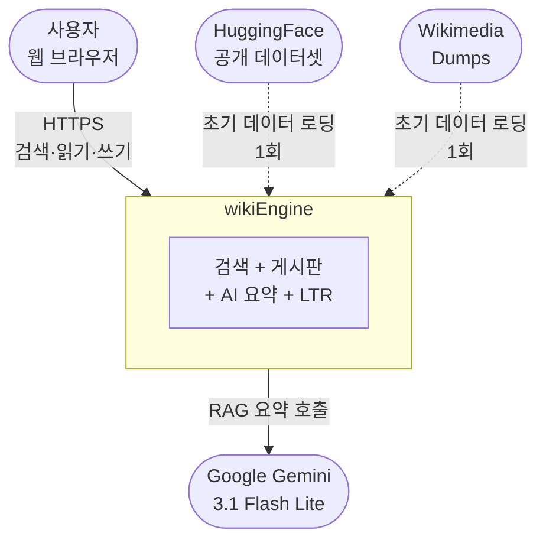
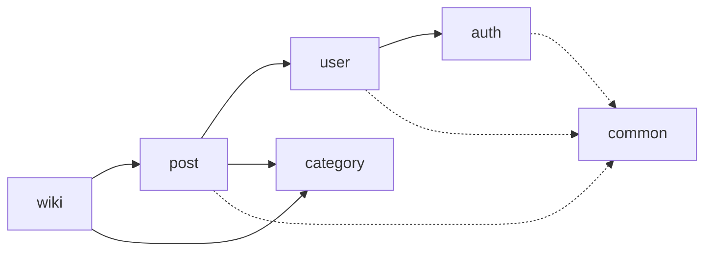

# Architecture

이 문서는 wikiEngine 의 시스템 구조를 [**C4 Model**](https://c4model.com/) 경량 변형으로 설명합니다.

> **C4 Model 이란?** Simon Brown 이 제안한 점진적 줌-인 방식의 아키텍처 설명 방법입니다. *Context*(외부) → *Container*(배포 단위) → *Component*(내부 컴포넌트) 3 단계로, 청중에 따라 적절한 추상화 레벨만 보여줄 수 있습니다.

목차:

- [Level 1 — System Context](#level-1--system-context)
- [Level 2 — Containers](#level-2--containers)
- [Level 3 — Components (Backend)](#level-3--components-backend)
- [데이터 흐름](#데이터-흐름)
- [모듈 의존 그래프](#모듈-의존-그래프)
- [관련 ADR](#관련-adr)

---

## Level 1 — System Context

**wikiEngine 이 *누구*와 *어떤 외부 시스템*과 상호작용하는가?**



- **사용자**: 검색·열람·게시·좋아요·댓글 (커뮤니티 성격)
- **Gemini**: 검색 결과 상위 N 문서 RAG 요약 + LTR 학습 데이터 생성 (LLM-as-a-Judge)
- **HuggingFace / Wikimedia**: 초기 12M 건 시드 데이터의 출처. 런타임 의존성 아님.

---

## Level 2 — Containers

**wikiEngine 은 *어떤 배포 단위*로 쪼개져 있는가?**

OCI Free Tier 4 대로 운영합니다. 각 컨테이너의 역할과 통신 경로:


> 위 그림이 보이지 않으면 [readme-images/architecture.svg](./readme-images/architecture.svg) 를 직접 열어주세요.

| 컨테이너 | 서버 | 역할 |
|---|---|---|
| **Nginx LB** | Server 1 | L7 로드 밸런서, R/W Split (`GET` → RR, 쓰기 → Primary) |
| **Spring Boot App** | Server 1, 2 | 도메인 로직 + Lucene 검색 임베드 |
| **MySQL Primary** | Server 1 | 쓰기 마스터 (12M 건) |
| **MySQL Replica** | Server 2 | 읽기 복제본 (binlog 기반, lag ≈ 1s) |
| **Redis Cluster** | Server 1, 2 | 3-shard Consistent Hashing (검색 캐시 + 자동완성 KV) |
| **Lucene Index** | Server 1, 2 (각자) | 39 GB FS 임베드 인덱스. rsync 로 동기화. |
| **Kafka (KRaft)** | Server 2 | `search.clicks`, `posts.cdc` 토픽 |
| **Debezium** | Server 2 | MySQL binlog → Kafka CDC |
| **Prometheus / Grafana / Loki** | Server 3, 4 | 메트릭 · 대시보드 · 로그 집계 |

각 결정의 *왜*는 ADR 참조:

- 왜 Elasticsearch 가 아니고 Lucene 직접 임베드? → [ADR-0001](./adr/0001-lucene-direct-vs-elasticsearch.md)
- 왜 Redis 3-shard 에 Consistent Hashing? → [ADR-0006](./adr/0006-tiered-cache-consistent-hashing.md)
- 왜 Nginx 에서 R/W Split? → [ADR-0007](./adr/0007-nginx-rw-split-mysql-replication.md)

---

## Level 3 — Components (Backend)

**Spring Boot App *내부* 는 어떻게 쪼개져 있는가?**

[Spring Modulith](https://spring.io/projects/spring-modulith) 기반 패키지 분리. 컴파일 타임에 의존 방향이 검증됩니다.

```
com.wiki.engine/
├── auth/          ← JWT 인프라 (의존: 없음)
│   ├── JwtTokenProvider
│   ├── JwtAuthenticationFilter
│   └── TokenBlacklist
│
├── user/          ← 사용자 도메인 + 인증 (의존: auth)
│   ├── UserController, UserService
│   └── (회원가입/로그인 엔드포인트)
│
├── category/      ← 카테고리 분류 (의존: 없음)
│   ├── CategoryService
│   └── CategoryClassificationService  ← 키워드 기반 30개 카테고리
│
├── wiki/          ← 위키 데이터 임포트 (의존: post, category)
│   ├── WikiImportService
│   ├── WikiXmlParser           ← Wikimedia XML
│   └── NamuWikiJsonParser      ← 나무위키 JSON
│
└── post/          ← 게시글 도메인 (의존: user, category)
    ├── Post, PostController, PostService
    ├── PostEvent               ← Modulith 이벤트
    └── internal/
        ├── lucene/             ← Lucene 검색 + LTR
        │   ├── LuceneIndexService    ← NRT writer
        │   ├── LuceneSearchService   ← DisMax(형태소 + n-gram)
        │   ├── LuceneIndexEventHandler  ← PostEvent 구독
        │   ├── XGBoostRanker         ← XGBoost4J 네이티브
        │   └── FeatureExtractor      ← 14개 LTR 피처
        ├── search/             ← 자동완성 CQRS
        │   ├── SearchLogCollector    ← 검색어 → MySQL
        │   ├── AutocompleteService   ← Redis flat KV 조회
        │   └── AutocompleteBuildJob  ← Spring Batch, 1h 주기
        ├── cdc/                ← Debezium 컨슈머
        │   └── PostsCdcConsumer
        └── rag/                ← Spring AI + Gemini
            ├── RagService
            └── AiSummaryDecisionService
```

각 결정의 *왜*:

- 자동완성을 왜 CQRS + MapReduce 로? → [ADR-0002](./adr/0002-autocomplete-cqrs-mapreduce.md)
- XGBoost 를 왜 ONNX 없이 네이티브? → [ADR-0003](./adr/0003-xgboost4j-native-binding.md)
- 검색 쿼리 왜 dis_max? → [ADR-0004](./adr/0004-disjunction-max-query-cjk.md)
- 인덱스 동기화 왜 이벤트 + CDC 이중화? → [ADR-0005](./adr/0005-index-sync-modulith-cdc.md)

---

## 데이터 흐름

### 흐름 1: 검색 요청 (Read Path)


```
1. Browser → Nginx LB (GET /api/search?q=...)
2. Nginx → Spring App (Round Robin: Server 1 or 2)
3. Spring → Caffeine L1 cache  → hit? return
                                ↓ miss
4. Spring → Redis L2 cache (Consistent Hashing)  → hit? populate L1 & return
                                ↓ miss
5. Spring → Lucene NRT Searcher
   ├─ DisMax Query: textQuery + ngramQuery*2.0 (tie_breaker=0.1)
   ├─ BM25 Top-N (N=200)
   └─ XGBoost LambdaMART re-rank → Top-K (K=20)
6. Spring → MySQL Replica (post 본문 hydrate)
7. Spring → Response + Async fire-and-forget RAG 요약 (SSE)
```

### 흐름 2: 게시글 작성 (Write Path)

```
1. Browser → Nginx LB (POST /api/posts) → 강제로 Server 1 (Primary)
2. Spring → MySQL Primary INSERT (트랜잭션)
3. Spring → PostEvent 발행 (Spring Modulith)
   ├─→ LuceneIndexEventHandler (in-process, 같은 트랜잭션 외부)
   │   └─→ Lucene IndexWriter.addDocument + maybeRefresh()
   └─→ (Server 2 는 별도 경로로 인덱싱)
4. MySQL binlog → Debezium → Kafka topic "posts.cdc"
5. Server 2 의 PostsCdcConsumer → Lucene 인덱스 갱신
```

### 흐름 3: 자동완성

자세한 그림: [readme-images/cqrs-architecture.svg](./readme-images/cqrs-architecture.svg)

```
[쓰기 경로 — CQRS Command]
사용자 검색 → SearchLogCollector → MySQL search_logs INSERT

[배치 경로 — MapReduce]
Spring Batch (1h 주기)
├─ Map:    search_logs → 키워드별 카운트
├─ Shuffle: 접두사(1~10자) 분해
├─ Reduce: 접두사별 Top-K 키워드 선정
└─ Write: Redis flat KV (key: prefix, value: JSON Top-K)

[읽기 경로 — CQRS Query]
사용자 입력 → Redis GET prefix → O(1) 응답
                           ↓ miss
                          Lucene title_raw PrefixQuery (fallback)
```

---

## 모듈 의존 그래프

Spring Modulith 가 컴파일 타임에 검증하는 의존 방향:



- 실선: 도메인 의존 (의도된 방향)
- 점선: 공통 유틸 사용
- ❌ `auth → user` 방향은 금지 — JWT 인프라가 도메인을 알 필요 없음

---

## 관련 ADR

| 영역 | ADR |
|---|---|
| 검색 엔진 선택 | [0001](./adr/0001-lucene-direct-vs-elasticsearch.md) |
| 자동완성 | [0002](./adr/0002-autocomplete-cqrs-mapreduce.md) |
| LTR | [0003](./adr/0003-xgboost4j-native-binding.md) |
| 검색 쿼리 | [0004](./adr/0004-disjunction-max-query-cjk.md) |
| 인덱스 동기화 | [0005](./adr/0005-index-sync-modulith-cdc.md) |
| 캐시 구조 | [0006](./adr/0006-tiered-cache-consistent-hashing.md) |
| DB / 로드밸런싱 | [0007](./adr/0007-nginx-rw-split-mysql-replication.md) |
