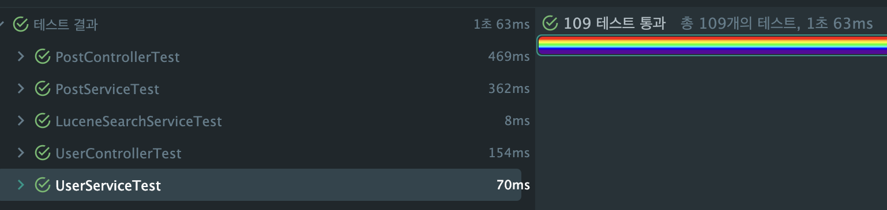
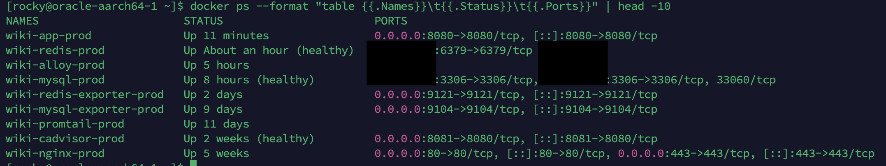
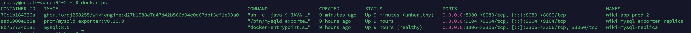
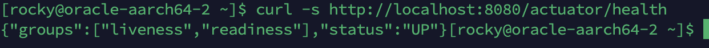
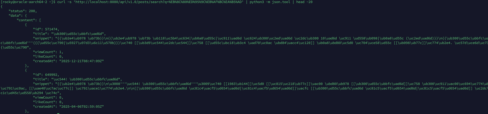
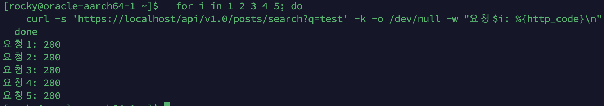

# App 스케일아웃 — Nginx L7 로드밸런싱 + Lucene Replica

## 이전 단계 요약

12단계(MySQL Replication)에서 DB 읽기 부하 분산이 완료되었다.

| 지표 | 12단계 결과 |
|------|----------|
| R/W 분리 | Primary ~50 ops/s (쓰기), Replica ~200 ops/s (읽기) |
| HikariCP | Primary 5 (Active 0~2), Replica 15 (Active 3~5) |
| Replication Lag | 0~1초 (부하 시) |
| Tiered Cache | L1 55% + L2 3% = 58% 히트, Origin 42% |
| App CPU (100 VU 피크) | **~100% (2코어 기준)** ← 병목 |
| 에러율 (100 VU) | 13.25% |
| P95 | 2,300ms |

DB는 여유 있지만(Primary Slow Query 0건, InnoDB 히트율 99.5%), **앱 CPU가 100%에 도달**하여 에러율 13.25%가 발생하고 있다. 13단계에서 App 인스턴스를 2대로 확장하여 CPU 병목을 해소한다.

---

## 왜 스케일아웃이 필요한가

### App CPU가 병목이다 — 데이터 근거

Phase 10(stress 테스트)과 Phase 12(After 측정)에서 일관되게 확인된 병목:

| 지표 | Phase 10 (200 VU) | Phase 12 (100 VU) | 판단 |
|------|-------------------|-------------------|------|
| App CPU | ~100% | ~100% | **병목** |
| MySQL CPU | 거의 0% | 거의 0% | 여유 |
| InnoDB 버퍼 풀 히트율 | 100% | 99.5% | I/O 병목 없음 |
| HikariCP Acquire | 1,250ms (200 VU) | < 1ms (100 VU) | CPU 포화의 증상 |
| Redis Lettuce P95 | - | ~3ms | 여유 |

> Phase 10 문서에서도 "HikariCP Active 60+는 **풀이 부족해서가 아니라 CPU 포화로 요청 처리가 느려져 커넥션 점유 시간이 길어진 것**"이라고 분석했다. 병목은 App CPU(Lucene BM25 스코어링 + Nori 형태소 분석)이다.

**CPU 소비 내역 (Lucene 검색 경로):**

```
검색 요청 → Nori 형태소 분석 (쿼리 파싱) → BM25 스코어링 (세그먼트 순회)
                                          → FeatureField 부스팅 (viewCount, likeCount)
                                          → Recency Decay (30일 반감기)

→ 이 전체가 CPU-bound 연산. 캐시 미스 시 매번 발생.
→ Origin 42%의 요청이 이 경로를 타므로, 동시 요청이 많으면 CPU 포화.
```

**스케일아웃의 효과 추정:**

```
현재 (App 1대):
  CPU 2코어 → 100 VU에서 100% → 에러율 13.25%

App 2대 (CPU 4코어 분산):
  읽기 요청을 2대에 분산 → 각 App CPU ~50%
  → 에러율 대폭 감소, P95 개선 기대

근거 — Queueing Theory (M/M/c 모델):
  이용률 ρ = λ / (c × μ)  (λ: 도착율, c: 서버 수, μ: 서비스율)

  현재: c=2코어, ρ ≈ 1.0 (포화 상태)
    → 대기확률 ≈ 100%, 대기열 급증, 응답시간 폭등
  App 2대: c=4코어, ρ ≈ 0.5
    → 대기확률 급감, 대기열 거의 소멸, 응답시간 대폭 개선

  ※ Little's Law (L = λW)는 안정 상태에서 동시 요청 수(L), 처리량(λ),
    응답시간(W)의 서술적 관계이며, 하나를 바꾸면 다른 것이 자동으로
    바뀐다는 인과 법칙이 아니다. 성능 개선의 핵심은 이용률(ρ) 감소이다.

  선형 확장(2배)은 아닌 이유:
    USL(Universal Scalability Law, Neil Gunther)에 따르면 노드 추가 시
    직렬화(serialization) 비용 + 일관성(coherence) 비용이 발생한다.
    공유 자원(MySQL Primary 쓰기, Redis 네트워크, Nginx 라우팅)이
    coherence 항으로 작용하여 이론적 2배에 미치지 못한다.
    단, CPU-bound 워크로드에서 직렬 분율이 낮으므로 효과는 크다.
```

### 대안 검토 — 스케일아웃 외에 선택지는 없는가?

| 대안 | 검토 결과 | 판단 |
|------|----------|------|
| **JVM 튜닝 (GC, 힙)** | Phase 10에서 이미 G1 GC + -Xmx1g 튜닝 완료. GC Pause는 P99 기여 ~5ms 수준으로 미미 | **탈락** (이미 완료) |
| **Lucene 쿼리 최적화** | BM25 + FeatureField + Recency Decay는 이미 최적화된 구조. 추가 최적화 여지 제한적 | **탈락** (이미 최적화) |
| **캐시 히트율 더 올리기** | L1+L2 합산 58%, Origin 42%. 나머지는 cold query + 롱테일 분포라 캐시로 더 줄이기 어려움 | **탈락** (한계) |
| **스케일업 (CPU 추가)** | Oracle Cloud Free Tier 서버 스펙 변경 불가 (ARM 2코어 고정) | **탈락** (인프라 제약) |
| **App 스케일아웃** | 서버 2에 App 2 배포 → CPU 2코어 추가 → 읽기 부하 분산 | **선택** |

### 전제조건 확인

스케일아웃을 위한 11~12단계의 사전 준비가 모두 완료되었다:

```
11단계 Redis    → 앱 Stateless 전환 (캐시/자동완성 Redis 공유)        ✅ 완료
12단계 Replica  → DB 읽기 분리 (App 2대 시 DB 부하 분산)             ✅ 완료
13단계 Scale    → 앱 인스턴스 확장 (CPU 분산)                        ← 지금
```

| 전제조건 | 상태 | 없으면 |
|----------|------|--------|
| Redis L2 캐시 | ✅ 완료 | App 간 캐시 불일치 → 히트율 절반 |
| 자동완성 flat KV (Redis) | ✅ 완료 | App별 Trie 독립 → 메모리 중복, 불일치 |
| MySQL Replication | ✅ 완료 | App 2대 × HikariCP 20 = 40 커넥션이 단일 MySQL에 집중 |
| TokenBlacklist Redis 전환 | ❌ 미완료 | App 1에서 로그아웃한 토큰을 App 2가 모름 → 보안 구멍 |

> **TokenBlacklist가 유일한 미완료 전제조건**이다. 현재 Caffeine(로컬 메모리)으로 구현되어 있으며, 코드 주석에도 "다중 서버 환경에서는 Redis 등 외부 저장소로 교체가 필요하다"고 명시되어 있다.

---

## 아키텍처

### 서버 토폴로지 (13단계)

```
서버 1 (ARM 2코어/12GB):
  ├── wiki-nginx-prod (Nginx)
  │     └── L7 로드밸런싱: GET → App 1 + App 2, 쓰기 → App 1 (Lucene write affinity)
  ├── wiki-app-prod (Spring Boot, Lucene Primary)
  │     ├── IndexWriter + SearcherManager (읽기+쓰기)
  │     └── DataSource: Write → Primary, Read → Replica
  ├── wiki-mysql-prod (Primary)
  ├── wiki-redis-prod (Redis)
  ├── Lucene 인덱스 (20GB, MMap)
  └── 사이드카 (Alloy, cAdvisor, Exporters)

서버 2 (ARM 2코어/12GB):
  ├── wiki-app-prod-2 (Spring Boot, Lucene Replica)  ← 13단계 신규
  │     ├── SearcherManager only (읽기 전용, IndexWriter 없음)
  │     └── DataSource: Write → Primary (서버 1), Read → Replica (로컬)
  ├── wiki-mysql-replica (Replica)
  ├── wiki-alloy-prod (로그 수집)  ← 13단계 신규
  ├── Lucene 인덱스 복사본 (20GB, rsync 동기화)  ← 13단계 신규
  └── 사이드카 (Node Exporter, MySQL Exporter)
```

### 요청 흐름

```
Client (HTTPS)
    │
    ▼
Nginx (서버 1, :443)
    │
    ├── GET /api/...  ──────────────────┐
    │   (읽기, 검색, 자동완성)          │
    │                                   ▼
    │                           ┌── least_conn ──┐
    │                           │                │
    │                     App 1 (서버 1)    App 2 (서버 2)
    │                     Lucene Primary   Lucene Replica
    │                           │                │
    │                     ┌─────┴────────────────┘
    │                     ▼
    │               L1 Caffeine → L2 Redis → MySQL Replica (읽기)
    │                                              (서버 2)
    │
    └── POST/PUT/DELETE  ──────────────────────────────────┐
        (게시글 생성/수정/삭제)                              │
                                                           ▼
                                                     App 1 (서버 1)
                                                     Lucene Primary
                                                           │
                                                     MySQL Primary (쓰기)
                                                           │
                                                     Lucene 인덱스 갱신
                                                           │
                                                     rsync (5분 주기)
                                                           │
                                                           ▼
                                                     App 2 Lucene 복사본 갱신
```

### Lucene 인덱스 동기화 전략

App 2대에서 Lucene을 운영하는 핵심 도전은 **인덱스 동기화**이다. MySQL은 Replication으로 자동 동기화되지만, Lucene은 로컬 파일 기반이므로 별도 전략이 필요하다.

**방식 검토:**

| 방식 | 장점 | 단점 | 판단 |
|------|------|------|------|
| **Elasticsearch** | 샤드 복제 자동 처리, 운영 부담 없음 | 메모리 최소 4GB, 학습 목적에 부합하지 않음 | **탈락** (아래 상세) |
| **공유 파일시스템 (NFS/OCI FSS)** | 단일 인덱스, 항상 일관, rsync 불필요 | 네트워크 I/O per search (MMap 성능 저하) | **탈락** (아래 상세) |
| **오브젝트 스토리지 (S3/OCI)** | 스냅샷 저장 + 각 서버 pull | 29GB 매번 다운로드 비효율 | **탈락** |
| **양쪽 독립 쓰기** | 코드 변경 최소 | 인덱스 불일치 (App 1 쓰기 ↔ App 2 쓰기) | **탈락** (일관성 문제) |
| **Redis Pub/Sub 알림** | 거의 실시간 동기화 | dual-write, Phase 14 CDC와 역할 중복 | **검토** (Phase 14에서) |
| **쓰기 App 1 고정 + rsync** | 단순, 단일 writer, MySQL Primary-Replica와 동일 패턴 | 최대 5분 stale | **선택** |

**"현업에서는 어떻게 하는가" — 왜 이 프로젝트에서 ES/NFS를 쓰지 않는가:**

현업에서 멀티 노드 검색을 운영할 때 가장 일반적인 방법은 **Elasticsearch**이다. ES는 내부적으로 Lucene 기반이지만, 샤드 복제/리밸런싱/장애 복구를 프레임워크가 자동 처리하므로 인덱스 동기화를 개발자가 직접 다룰 필요가 없다. 두 번째로 **공유 파일시스템(AWS EFS, OCI FSS)**을 양쪽 서버에 NFS 마운트하여 하나의 인덱스를 공유하는 방식이 있다.

이 프로젝트에서 두 방식을 쓰지 않는 이유:

| 방식 | 현업에서의 장점 | 이 프로젝트에서 쓰지 않는 이유 |
|------|---------------|--------------------------|
| **Elasticsearch** | 샤드 복제 자동, REST API, 운영 도구 풍부 | ① ES 최소 메모리 4GB — Free Tier 자원 부족 ② **학습 목적**: ES를 쓰면 역색인/세그먼트/NRT/MMap 같은 검색엔진 핵심 원리를 경험할 수 없음. raw Lucene으로 직접 구축하고, 분산 환경에서의 인덱스 동기화 문제를 **직접 경험**하는 것이 포트폴리오로서 더 가치 있음 |
| **NFS/OCI FSS** | 단일 인덱스, rsync 불필요 | ① Lucene MMapDirectory는 OS 페이지 캐시에 의존 — NFS 위에서는 매 검색 I/O마다 네트워크 왕복 발생, BM25 스코어링 시 랜덤 I/O 누적으로 성능 수 배 저하 (Lucene JIRA LUCENE-673, Atlassian 공식 경고) ② OCI FSS는 Free Tier 아님 (월 ~$3) |

**이 프로젝트의 포지션**: "ES 없이 raw Lucene으로 검색엔진을 직접 구축하고, 멀티 노드에서 인덱스 동기화(SnapshotDeletionPolicy + Refresh Pause + rsync), 레이스 컨디션(LUCENE-628), 빈 디렉토리 기동 실패 등 분산 환경의 실제 문제를 직접 경험하고 해결했다" — ES를 쓰면 이런 문제를 아예 모르고 넘어간다. 면접에서 "왜 ES 안 쓰셨나요?"에 대한 명확한 답변이 된다.

**참고 — CI/CD와 데이터 동기화는 별개 파이프라인**: GitHub Actions CI/CD는 **코드**를 배포하는 것이지, **데이터**(Lucene 인덱스 29GB)를 배포하는 것이 아니다. 인덱스 데이터 동기화는 rsync cron이라는 별도 파이프라인으로 처리하며, 이는 MySQL Replication이 CI/CD와 별개인 것과 같은 원리이다.

**"쓰기 App 1 고정 + rsync" 선택 근거:**

1. **MySQL Primary-Replica와 동일한 사고 모델**: App 1이 Lucene Primary(쓰기+읽기), App 2가 Lucene Replica(읽기 전용). 12단계에서 이미 검증한 패턴.

2. **stale 허용 가능**: 커뮤니티 게시판에서 검색 결과가 5분 늦게 반영되는 것은 UX에 영향 없음. Phase 12에서 Replication Lag 수 초를 허용한 것과 같은 논리.

3. **Origin 42%만 Lucene 조회**: 캐시 히트(L1+L2 58%)된 요청은 Lucene을 타지 않으므로, 실제 stale 영향은 전체 요청의 42% × 5분 stale 확률.

4. **Phase 14 CDC에서 개선**: Phase 14에서 MySQL binlog 기반 이벤트를 도입하면, Lucene 인덱스도 이벤트 기반으로 실시간 동기화할 수 있다. Phase 13에서는 rsync로 충분.

**rsync 동기화 상세:**

```
Lucene 인덱스 구조:
  /data/lucene/
  ├── segments_N           ← 커밋 포인트 (어떤 세그먼트가 활성인지)
  ├── _0.cfs, _0.cfe       ← 세그먼트 파일 (불변, 새 세그먼트만 추가)
  ├── _1.cfs, _1.cfe
  └── write.lock           ← IndexWriter 락 (App 2에는 불필요)

Lucene 세그먼트는 불변(immutable):
  - 새 문서 추가 → 새 세그먼트 파일 생성
  - 머지 → 기존 세그먼트 삭제 + 새 세그먼트 생성
  - segments_N → 활성 세그먼트 목록 (커밋 시 원자적 갱신, Lucene 5.0+ NIO.2 ATOMIC_MOVE)
```

**rsync 안전성 — SnapshotDeletionPolicy 기반:**

rsync는 **파일 복사 순서를 보장하지 않는다**. 단순 rsync만으로는 segments_N이 세그먼트 파일보다 먼저 복사될 수 있고, 이 경우 App 2의 `maybeRefresh()`가 아직 없는 세그먼트를 참조하여 IOException이 발생한다.

Lucene 커미터 Mike McCandless의 권고: *"You must first close the IndexWriter when using rsync, else the copy can be corrupt."* ([Lucene's NRT segment index replication](https://blog.mikemccandless.com/2017/09/lucenes-near-real-time-segment-index.html)) — 또는 `SnapshotDeletionPolicy`를 사용하여 일관된 스냅샷을 잡은 후 rsync해야 한다.

```
SnapshotDeletionPolicy + Refresh Pause 기반 rsync 흐름:
  1. App 2: refresh 일시 중단 (rsync 중 maybeRefresh 차단)
  2. App 1: commit() + snapshot() → 현재 커밋 포인트 고정
     → 이 시점의 세그먼트 파일은 머지/GC에서 삭제 보호됨
  3. rsync: 모든 파일 복사
     → snapshot 보호: 참조된 세그먼트가 중간에 삭제되지 않음
     → refresh 중단: App 2가 불완전한 상태를 읽지 않음
  4. App 1: snapshot 해제 → GC가 불필요 세그먼트 정리
  5. App 2: refresh 재개 + 즉시 maybeRefresh() → 새 segments_N 감지 → 새 reader 오픈

두 가지 보호 메커니즘이 동시에 필요한 이유:

  ① SnapshotDeletionPolicy (App 1 측):
     - IndexWriter가 rsync 중에도 계속 동작 (쓰기 요청 처리)
     - 머지가 발생하면 기존 세그먼트 파일이 삭제될 수 있음
     - snapshot이 참조를 유지하면 삭제 방지 → rsync가 완전한 복사본 생성

  ② Refresh Pause (App 2 측, LUCENE-628 대응):
     - rsync는 파일 복사 순서를 보장하지 않음
     - segments_N이 세그먼트 파일보다 먼저 도착할 수 있음
     - 이 상태에서 maybeRefresh() 발동 → FileNotFoundException (~10% 실패율 보고)
     - rsync 완료까지 refresh를 차단하면 이 레이스 컨디션 원천 방지

rsync 중간에 중단되는 경우:
  - refresh가 중단 상태이므로 App 2는 불완전한 디렉토리를 읽지 않음 → 안전
  - 스크립트 실패 시 resume-refresh가 호출되지 않으면?
    → 5분 후 다음 cron 실행 시 pause-refresh부터 다시 시작
    → 안전장치: resume-refresh에 30초 타임아웃 자동 해제 (아래 코드 참조)
```

**동기화 스크립트 (cron, 5분 주기):**

```bash
#!/bin/bash
# lucene-sync.sh — App 1 → App 2 Lucene 인덱스 동기화
# SnapshotDeletionPolicy (세그먼트 삭제 방지) + Refresh Pause (레이스 컨디션 방지)

PRIMARY_HOST="{{ hostvars['app-arm'].private_ip }}"
LUCENE_PATH="/data/lucene"
APP2_LOCAL="http://localhost:8080"

# 1. App 2 refresh 일시 중단 (rsync 중 maybeRefresh 차단 — LUCENE-628 대응)
curl -sf -X POST ${APP2_LOCAL}/internal/lucene/pause-refresh || true

# 2. App 1에 Lucene commit + snapshot 요청
SNAPSHOT_GEN=$(curl -sf -X POST http://${PRIMARY_HOST}:8080/internal/lucene/snapshot)
if [ -z "$SNAPSHOT_GEN" ]; then
  echo "$(date) ERROR: snapshot 요청 실패" >&2
  curl -sf -X POST ${APP2_LOCAL}/internal/lucene/resume-refresh || true
  exit 1
fi

# 3. rsync (SSH 키 인증 사용 — Step 4에서 설정)
rsync -az --delete \
  --exclude='write.lock' \
  ${PRIMARY_HOST}:${LUCENE_PATH}/ ${LUCENE_PATH}/

# 4. App 1 snapshot 해제
curl -sf -X DELETE "http://${PRIMARY_HOST}:8080/internal/lucene/snapshot/${SNAPSHOT_GEN}" || true

# 5. App 2 refresh 재개 + 즉시 refresh (rsync 완료 후이므로 안전)
curl -sf -X POST ${APP2_LOCAL}/internal/lucene/resume-refresh || true

echo "$(date) OK: sync completed (snapshot gen=${SNAPSHOT_GEN})"
```

> `--exclude='write.lock'`: App 2는 IndexWriter가 없으므로 write.lock 불필요. rsync로 전송 시 App 2에서 락 충돌 방지.

### Nginx 로드밸런싱 전략

현재 Nginx는 단일 upstream `app:8080`만 사용한다. 13단계에서 **HTTP 메서드 기반 라우팅**으로 읽기/쓰기를 분리한다.

```
현재:
  upstream app { server app:8080; }
  → 모든 요청 → App 1

13단계:
  upstream app_read { server app:8080; server {{ app2_ip }}:8080; }  ← 양쪽 분산
  upstream app_write { server app:8080; }                            ← App 1 고정

  map $request_method → GET/HEAD/OPTIONS → app_read
                      → POST/PUT/DELETE  → app_write
```

**map 기반 라우팅 선택 근거**: Nginx의 `if` 디렉티브는 `location` 블록 내에서 예측 불가능한 동작을 하므로("if is evil" — Nginx 공식 위키), `map` 디렉티브로 변수를 미리 설정한 후 `proxy_pass`에서 사용한다. `map`은 설정 로드 시 해석되어 런타임 오버헤드가 없다.

**로드밸런싱 알고리즘: `least_conn`**

| 알고리즘 | 동작 | 적합 케이스 | 판단 |
|---------|------|-----------|------|
| round-robin (기본) | 순차 분배 | 균일한 요청 처리시간 | 부적합 (검색 vs 캐시 히트 차이 큼) |
| **least_conn** | 활성 커넥션 적은 쪽으로 | 요청별 처리시간 편차 큰 경우 | **선택** |
| ip_hash | IP 기반 고정 | 세션 유지 필요 시 | 불필요 (JWT stateless) |

검색 요청(Lucene BM25)은 수십~수백 ms, 캐시 히트 요청은 ~1ms로 처리시간 편차가 크므로, `least_conn`이 가장 균등하게 분배한다.

### TokenBlacklist Redis 전환

현재 `TokenBlacklist`는 Caffeine(로컬 메모리)으로 구현되어 있다. 멀티 인스턴스에서는 **App 1에서 로그아웃한 토큰을 App 2가 모르는** 보안 문제가 발생한다.

```
문제 시나리오:
  1. 사용자 로그아웃 → App 1이 토큰을 Caffeine 블랙리스트에 추가
  2. 같은 토큰으로 요청 → Nginx가 App 2로 라우팅
  3. App 2의 Caffeine에는 블랙리스트 없음 → 토큰 유효로 판단
  4. 로그아웃된 토큰으로 API 접근 성공 → 보안 구멍

해결:
  TokenBlacklist를 Redis로 전환
  → App 1, App 2 모두 같은 Redis를 조회
  → 로그아웃 즉시 양쪽에서 차단
```

**구현 방안:**

1. `TokenBlacklist` 인터페이스 추출 (`add`, `isBlacklisted`)
2. `RedisTokenBlacklist` 구현 (Redis SET + TTL)
3. 기존 Caffeine 구현은 제거 (단일 서버 환경이 끝났으므로)

```java
// 인터페이스 추출
public interface TokenBlacklist {
    void add(String token);
    boolean isBlacklisted(String token);
}

// Redis 구현
@Component
public class RedisTokenBlacklist implements TokenBlacklist {
    private final StringRedisTemplate redisTemplate;
    private final JwtTokenProvider jwtTokenProvider;

    private static final String KEY_PREFIX = "blacklist:";

    @Override
    public void add(String token) {
        // TTL = JWT가 만료되기까지 "남은 시간" (전체 만료시간이 아님)
        // 예: JWT 30분짜리를 발급 20분 후에 로그아웃 → TTL = 10분
        Date expiration = jwtTokenProvider.getExpiration(token);
        Duration remainingTtl = Duration.between(Instant.now(), expiration.toInstant());
        if (remainingTtl.isPositive()) {
            redisTemplate.opsForValue()
                .set(KEY_PREFIX + token, "1", remainingTtl);
        }
        // 이미 만료된 토큰이면 블랙리스트 추가 불필요 (어차피 검증에서 거부됨)
    }

    @Override
    public boolean isBlacklisted(String token) {
        try {
            return Boolean.TRUE.equals(redisTemplate.hasKey(KEY_PREFIX + token));
        } catch (RedisConnectionFailureException e) {
            // Redis 장애 시 보수적 판단: 블랙리스트 확인 불가 → 토큰 거부 (보안 우선)
            log.warn("Redis 연결 실패 — 블랙리스트 확인 불가, 토큰 거부 (보안 우선): {}", e.getMessage());
            return true;
        }
    }
}
```

> **TTL = "남은 시간"인 이유**: JWT 전체 만료시간(예: 30분)을 TTL로 설정하면, 발급 25분 후에 로그아웃한 토큰이 Redis에 25분간 불필요하게 남는다. "남은 시간"(예: 5분)으로 설정하면 JWT가 자연 만료되는 시점에 Redis에서도 자동 제거되어 메모리를 최적으로 사용한다. 이 패턴은 SuperTokens, Baeldung 등에서 JWT 블랙리스트의 표준 구현으로 권장된다.

**Redis 장애 시 TokenBlacklist 동작 정책:**

| 방안 | 동작 | 장단점 | 판단 |
|------|------|--------|------|
| **보수적 거부 (선택)** | Redis 연결 실패 시 `isBlacklisted()` → true 반환 | 보안 유지, 하지만 정상 토큰도 거부됨 (일시적 UX 손해) | **선택** |
| 허용 | Redis 연결 실패 시 `isBlacklisted()` → false 반환 | UX 유지, 하지만 로그아웃된 토큰이 유효해짐 (보안 구멍) | 탈락 |
| Caffeine fallback | Redis 실패 시 로컬 Caffeine 캐시로 fallback | 부분적 보호, 인스턴스 간 불일치 | 과도한 복잡도 |

**선택 근거**: 커뮤니티 게시판에서 Redis가 일시적으로 다운되었을 때, 사용자가 재로그인하면 되므로 UX 영향이 제한적이다. 반면 보안 구멍은 허용할 수 없다. Grafana 알림(Redis down → Critical)으로 빠른 복구를 유도한다.

### 자원 배분 비용 분석 (Oracle Cloud Free Tier)

```
App 2 도입의 자원 비용:
  서버 2 App 2 JVM:     2G (-Xmx1g, 총 resident ~2G)
  서버 2 Alloy:         128M (로그 수집)
  서버 2 Lucene 디스크:  20G (인덱스 복사본)
  → 서버 2 메모리 추가: ~2.1G
  → 서버 2 합계: 4.1G (기존) + 2.1G = ~6.2G
  → 남은 메모리: 12G - 6.2G = ~5.8G → OS + Lucene 페이지 캐시(~5G)

App 2 도입의 이득:
  CPU 2코어 추가 → 읽기 부하 50% 분산
  100 VU에서 에러율 13.25% → 대폭 감소 기대
  P95 2,300ms → 개선 기대
  향후 App 3대 확장 시 동일 패턴 적용 가능

판단:
  서버 2 메모리 2.1G 투자 → CPU 병목 해소 + 가용성 향상
  → 투자 가치 있음
```

> **실무(AWS)에서의 비용 비교 참고**: EC2 t3.medium(2vCPU/4GB) 1대 = ~$30/월. App 2대로 확장하면 EC2 2대($60) + ALB($15) = ~$75/월 (2.5배 증가). 하지만 TPS가 ~1.7배 증가하므로 TPS당 비용은 오히려 감소하고, 단일 장애점 제거 + 에러율 13%→<3% 감소로 SLA 개선 효과까지 포함하면 투자 대비 가치가 있다. 참고로 AWS에서는 Auto Scaling Group으로 부하에 따라 인스턴스를 자동 조절할 수 있으나, 이 프로젝트는 OCI Free Tier 고정 자원이므로 수동 2대 고정이다.

> **Lucene 페이지 캐시**: Lucene MMapDirectory는 OS 페이지 캐시를 활용한다. 서버 2의 남은 ~5.8G 중 상당 부분이 Lucene 인덱스 파일의 페이지 캐시로 사용된다. 20GB 인덱스 중 ~29%가 캐시되며, 자주 접근하는 세그먼트(인기 검색어 포스팅 리스트)는 거의 항상 캐시에 있다. 서버 1(~4.7G 여유)보다 캐시 용량이 크므로 검색 응답시간이 오히려 나을 수 있다.

---

## 구현 계획

### 작업 항목 — 실행 순서

```
전체 흐름:
  Step 1.  Before 측정 (현재 상태 기록)
  Step 2.  TokenBlacklist Redis 전환 (보안 전제조건)
  Step 3.  Lucene Primary/Replica 모드 분리 (코드 변경)
  Step 4.  서버 2 App 배포 (Ansible, Docker, 환경변수)
  Step 5.  Nginx 로드밸런싱 설정 (메서드 기반 라우팅)
  Step 6.  Lucene 인덱스 동기화 (초기 복사 + rsync cron)
  Step 7.  모니터링 추가 (App 2 메트릭, Grafana 인스턴스 비교)
  Step 8.  기능 검증 (로드밸런싱, 장애 대응, 보안)
  Step 9.  After 측정 (Before와 비교)
  Step 10. 결과 정리
```

---

### Step 1. Before 측정

| # | 측정 | 방법 |
|---|------|------|
| 1 | App CPU (100 VU 피크) | Grafana cAdvisor / 호스트 CPU |
| 2 | 에러율 (100 VU) | k6 |
| 3 | P95 / P99 응답시간 | k6 |
| 4 | 캐시 히트율 (L1+L2) | Grafana Redis/Caffeine 메트릭 |
| 5 | HikariCP Active | Grafana HikariCP 대시보드 |

> 12단계 After 측정 결과를 Before로 재활용 가능 (동일 환경, 동일 k6 시나리오).

---

### Step 2. TokenBlacklist Redis 전환 — 코드 완료

| # | 작업 | 확인 방법 | 상태 |
|---|------|----------|------|
| 1 | `TokenBlacklist` 인터페이스 추출 | 컴파일 + 테스트 109개 통과 | **완료** |
| 2 | `RedisTokenBlacklist` 구현 (StringRedisTemplate + 남은 TTL) | 컴파일 + 테스트 109개 통과 | **완료** |
| 3 | 기존 Caffeine 기반 `TokenBlacklist` 제거 (인터페이스로 대체) | 컴파일 + 테스트 109개 통과 | **완료** |
| 4 | `JwtAuthenticationFilter` 변경 불필요 확인 (인터페이스 타입으로 주입) | 코드 확인 — `@RequiredArgsConstructor`로 `TokenBlacklist` 타입 주입 | **완료** |
| 5 | `AuthService` 변경 불필요 확인 | 코드 확인 — 동일 | **완료** |
| 6 | 테스트: 로그아웃 → 같은 토큰으로 재요청 → 401 | 수동 또는 통합 테스트 | 배포 대기 |
| 7 | 테스트: JWT 만료 후 Redis 키 자동 삭제 | Redis CLI `TTL blacklist:...` | 배포 대기 |

**테스트 결과 (2026-03-20):**

109개 테스트 전부 통과, 1초 63ms. Caffeine → 인터페이스 전환으로 인한 기존 테스트 깨짐 없음. 테스트 환경에서는 `@MockitoBean`으로 `TokenBlacklist`를 Mock하므로 Redis 연결 없이 통과.



**코드 변경 내역:**

| 파일 | 변경 |
|------|------|
| `TokenBlacklist.java` | 클래스 → 인터페이스 변환 (Caffeine 의존성 제거, `add`/`isBlacklisted` 시그니처만) |
| `RedisTokenBlacklist.java` (신규) | `StringRedisTemplate` 기반 구현, TTL = `JwtTokenProvider.getExpirationTime()` (남은 시간), Redis 장애 시 보수적 거부 |
| `JwtAuthenticationFilter.java` | 변경 없음 |
| `AuthService.java` | 변경 없음 |

**Redis 메모리 영향:**

```
블랙리스트 키 크기 추정:
  키: "blacklist:" + JWT 토큰 (약 200 bytes) = ~215 bytes
  값: "1" = 1 byte
  Redis 오버헤드: ~64 bytes per key
  → 키 당 ~280 bytes

동시 블랙리스트 토큰 수:
  JWT 만료시간 30분 = 1,800초
  로그아웃 빈도: 분당 ~10건 (추정)
  → 최대 동시: ~300개 × 280 bytes = ~82 KB

  → Redis 메모리 영향 무시 가능 (현재 49MB 사용 중)
```

---

### Step 3. Lucene Primary/Replica 모드 분리 — 코드 완료

| # | 작업 | 확인 방법 | 상태 |
|---|------|----------|------|
| 1 | `application.yml`에 `lucene.mode` 프로퍼티 추가 | 설정 파일 확인 | **완료** |
| 2 | `LuceneConfig` — `SnapshotDeletionPolicy` + `@ConditionalOnProperty` | 컴파일 + 테스트 109개 통과 | **완료** |
| 3 | `LuceneConfig` — Directory 기반 SearcherManager (replica) | 컴파일 + 테스트 109개 통과 | **완료** |
| 4 | `LuceneIndexService` — IndexWriter null 시 쓰기 skip (indexPost, deleteFromIndex, indexAll) | 컴파일 + 테스트 109개 통과 | **완료** |
| 5 | `LuceneInternalController` — snapshot/commit/refresh/pause-refresh/resume-refresh | 컴파일 | **완료** |
| 6 | `LuceneReplicaRefresher` — 30초 주기 refresh + pause/resume + 30초 auto-resume | 컴파일 | **완료** |
| 7 | Replica 모드 기동 확인 | 배포 후 로그 확인 | 배포 대기 |
| 8 | `/internal/lucene/*` 엔드포인트 curl 테스트 | 배포 후 확인 | 배포 대기 |

**테스트 결과 (2026-03-20):**

109개 테스트 전부 통과. 테스트 환경에서는 `lucene.mode` 미설정 → `matchIfMissing=true`로 primary 모드 동작. `LuceneIndexService`에서 `@Autowired(required=false) IndexWriter`는 테스트에서 `@Mock`으로 주입되므로 null이 아님.


**코드 변경 내역:**

| 파일 | 변경 |
|------|------|
| `LuceneConfig.java` | `SnapshotDeletionPolicy` 빈 추가, `IndexWriter` 빈에 `@ConditionalOnProperty(matchIfMissing=true)`, `SearcherManager`에 writer null 분기 (Directory 기반) |
| `LuceneIndexService.java` | `@RequiredArgsConstructor` → 명시적 생성자 (`@Autowired(required=false) IndexWriter`), `indexPost`/`deleteFromIndex`/`indexAll`에 replica skip 가드 |
| `LuceneReplicaRefresher.java` (신규) | Replica 전용 30초 주기 refresh + pause/resume + auto-resume 안전장치 |
| `LuceneInternalController.java` (신규) | `/internal/lucene/snapshot`, `/commit`, `/refresh`, `/pause-refresh`, `/resume-refresh` |
| `application.yml` | `lucene.mode: ${LUCENE_MODE:primary}` 추가 |

**LuceneConfig 변경:**

```java
@Configuration
class LuceneConfig {

    @Value("${lucene.mode:primary}")
    private String mode;

    @Bean
    Directory luceneDirectory() throws IOException {
        return MMapDirectory.open(Path.of(indexPath));
    }

    @Bean
    Analyzer luceneAnalyzer() {
        return new KoreanAnalyzer();
    }

    // Primary 모드: rsync 시 세그먼트 보호를 위한 SnapshotDeletionPolicy
    @Bean
    @ConditionalOnProperty(name = "lucene.mode", havingValue = "primary", matchIfMissing = true)
    SnapshotDeletionPolicy snapshotDeletionPolicy() {
        return new SnapshotDeletionPolicy(new KeepOnlyLastCommitDeletionPolicy());
    }

    // Primary 모드에서만 IndexWriter 생성
    @Bean(destroyMethod = "close")
    @ConditionalOnProperty(name = "lucene.mode", havingValue = "primary", matchIfMissing = true)
    IndexWriter luceneIndexWriter(Directory directory, Analyzer analyzer,
                                  SnapshotDeletionPolicy snapshotPolicy) throws IOException {
        IndexWriterConfig config = new IndexWriterConfig(analyzer);
        config.setOpenMode(IndexWriterConfig.OpenMode.CREATE_OR_APPEND);
        config.setRAMBufferSizeMB(256);
        config.setIndexDeletionPolicy(snapshotPolicy);
        return new IndexWriter(directory, config);
    }

    @Bean(destroyMethod = "close")
    SearcherManager luceneSearcherManager(
            @Autowired(required = false) IndexWriter writer,
            Directory directory) throws IOException {
        if (writer != null) {
            // Primary: NRT reader from IndexWriter
            return new SearcherManager(writer, null);
        }
        // Replica: reader from Directory (rsync 갱신 감지 — committed 변경만)
        return new SearcherManager(directory, null);
    }
}
```

> **SnapshotDeletionPolicy**: rsync 중에 IndexWriter가 머지를 실행하면 기존 세그먼트 파일이 삭제될 수 있다. `SnapshotDeletionPolicy`로 커밋 포인트를 잡으면 해당 시점의 세그먼트 파일이 삭제에서 보호되어, rsync가 일관된 복사본을 만들 수 있다. snapshot 해제 후 GC가 불필요 파일을 정리한다.

**LuceneIndexService 변경 (쓰기 메서드만):**

```java
@Service
class LuceneIndexService {

    private final IndexWriter indexWriter;  // null in replica mode

    LuceneIndexService(@Autowired(required = false) IndexWriter indexWriter, ...) {
        this.indexWriter = indexWriter;
        ...
    }

    void indexPost(Post post) throws IOException {
        if (indexWriter == null) {
            log.debug("Lucene replica mode — skipping index for post {}", post.getId());
            return;
        }
        // 기존 로직...
    }

    void deleteFromIndex(Long postId) throws IOException {
        if (indexWriter == null) {
            log.debug("Lucene replica mode — skipping delete for post {}", postId);
            return;
        }
        // 기존 로직...
    }
}
```

> **기존 PostService 변경 없음**: `PostService.indexSafely()`는 `LuceneIndexService.indexPost()`를 try-catch로 감싸서 호출한다. replica 모드에서 `indexPost()`가 조기 반환하면 PostService 입장에서는 정상 완료. MySQL 쓰기는 Primary로 정상 처리된다.

**Replica 모드 주기적 SearcherManager 갱신:**

```java
@Component
@ConditionalOnProperty(name = "lucene.mode", havingValue = "replica")
class LuceneReplicaRefresher {

    private final SearcherManager searcherManager;
    private volatile boolean paused = false;
    private volatile long pausedAt = 0;

    private static final long AUTO_RESUME_TIMEOUT_MS = 30_000; // 30초 안전장치

    // 30초마다 디렉토리 변경 감지 → 새 reader 오픈
    @Scheduled(fixedRate = 30_000)
    void refresh() throws IOException {
        // pause 상태에서 타임아웃 초과 시 자동 resume (스크립트 실패 안전장치)
        if (paused && System.currentTimeMillis() - pausedAt > AUTO_RESUME_TIMEOUT_MS) {
            log.warn("Refresh pause 타임아웃 — 자동 resume (lucene-sync.sh 실패 가능성)");
            paused = false;
        }
        if (!paused) {
            searcherManager.maybeRefresh();
        }
    }

    /** rsync 시작 전 호출 — maybeRefresh() 차단 (LUCENE-628 대응) */
    void pause() {
        this.pausedAt = System.currentTimeMillis();
        this.paused = true;
        log.info("Lucene replica refresh paused for rsync");
    }

    /** rsync 완료 후 호출 — 즉시 refresh + 주기적 refresh 재개 */
    void resume() throws IOException {
        this.paused = false;
        searcherManager.maybeRefresh(); // rsync 완료 직후 즉시 반영
        log.info("Lucene replica refresh resumed");
    }
}
```

> Primary 모드에서는 매 write 후 `maybeRefresh()`를 호출하므로 이 스케줄러 불필요. Replica 모드에서만 활성화하여 rsync 후 변경사항을 감지한다.
>
> **안전장치**: `pause()` 후 30초 내에 `resume()`이 호출되지 않으면(스크립트 비정상 종료 등) 자동으로 resume된다. 이 시점에 디렉토리가 불완전할 수 있으나, Lucene의 crash-safe 설계에 의해 마지막 유효한 커밋 포인트(이전 segments_N)를 사용하므로 데이터 손상은 없다.

**환경변수:**

```yaml
# application.yml
lucene:
  mode: ${LUCENE_MODE:primary}

# 서버 1 env.prod.j2
LUCENE_MODE=primary

# 서버 2 env.prod.j2
LUCENE_MODE=replica
```

---

### Step 4. 서버 2 App 배포 (Ansible) — 완료

| # | 작업 | 확인 방법 | 상태 |
|---|------|----------|------|
| 1 | **서버 1 Redis 포트 노출** (private IP:6379 바인딩 + `--bind 0.0.0.0`) | 서버 2에서 `redis-cli ping` → PONG | **완료** |
| 2 | **SSH 키 교환** (서버 2 → 서버 1 패스워드리스 rsync용) | `ssh {서버1_IP} echo ok` | **완료** |
| 3 | 서버 2 docker-compose.yml.j2에 App 2 컨테이너 추가 | `docker ps` → wiki-app-prod-2 running | **완료** |
| 4 | 서버 2 env.prod.j2에 App 2 환경변수 추가 | LUCENE_MODE=replica, FLYWAY_ENABLED=false 등 | **완료** |
| 5 | 서버 2 Alloy 컨테이너 | 임시 비활성화 (alloy-config 템플릿 미배포) | **보류** |
| 6 | 서버 2 방화벽: TCP/8080 + TCP/6379 허용 | CI/CD에서 firewall 적용 확인 | **완료** |
| 7 | **초기 Lucene 인덱스 복사** (서버 1 → 서버 2, 29GB) | `/data/lucene/wiki-index/` 29GB 확인 | **완료** |
| 8 | App 2 healthcheck 통과 | `curl actuator/health` → `{"status":"UP"}` | **완료** |
| 9 | App 2 검색 테스트 | "대한민국" 검색 → 정상 결과 반환 | **완료** |

**배포 과정에서 해결한 이슈:**

1. **CI/CD `app_image=unused` 문제**: 서버 2에 실제 GHCR 이미지를 전달하도록 deploy.yml 수정
2. **GHCR 로그인 누락**: 서버 2 Ansible 태스크에 `docker_login` 추가
3. **빈 Lucene 디렉토리 기동 실패**: `LuceneConfig`에서 replica 모드 빈 디렉토리 시 빈 인덱스 자동 초기화
4. **Alloy 설정 파일 미배포**: Alloy 컨테이너 임시 비활성화 (고아 컨테이너 삭제)
5. **LUCENE_INDEX_PATH 불일치**: 하드코딩 `/data/lucene` → `{{ lucene_index_path }}` 변수 참조로 수정
6. **healthcheck 타임아웃**: `wait_timeout` 120→300초









**배포 순서 — Lucene 인덱스 없이 트래픽 유입 방지:**

App 2를 Nginx 풀에 투입하기 **전에** Lucene 인덱스가 완전히 복사되어야 한다. 인덱스 없이 healthcheck만 통과하면 검색 요청이 빈 결과를 반환하거나 예외가 발생한다.

```
안전한 배포 순서:
  1. 서버 2에 인프라 준비 (Redis 포트, SSH 키, 방화벽)
  2. 초기 Lucene 인덱스 복사 (rsync 20GB, ~3분)
  3. App 2 컨테이너 기동 (Lucene 인덱스가 이미 있으므로 정상 기동)
  4. App 2 healthcheck 통과 확인
  5. App 2에서 검색 API 수동 테스트 (정상 결과 반환 확인)
  6. Nginx 설정 변경 + reload (App 2를 풀에 투입)

  ※ 이 순서가 아니면 App 2가 빈 인덱스로 트래픽을 받는 위험이 있음
```

**App 2 Caffeine L1 cold start 인식:**

App 2 기동 직후 Caffeine L1 캐시가 비어 있어, App 1(warm cache) 대비 캐시 미스율이 높다. 이 기간 동안 App 2의 Lucene 조회 비율이 높아져 CPU 사용량이 일시적으로 App 1보다 높을 수 있다. `least_conn`이 이를 자동으로 보상하여 App 2에 덜 라우팅하므로 서비스 영향은 없지만, After 측정 시 **warm-up 완료 후** 측정해야 정확한 비교가 된다. warm-up 시간은 트래픽 패턴에 따라 수 분~수십 분.

**서버 1 Redis 포트 노출 (필수 — 현재 Docker 내부만 접근 가능):**

현재 서버 1의 Redis는 `ports` 지시자가 없어 Docker bridge 네트워크 내부에서만 접근 가능하다. 서버 2의 App 2가 Redis에 접근하려면 12단계에서 MySQL Primary 포트를 private IP에 바인딩한 것과 동일한 패턴으로 포트를 노출해야 한다:

```yaml
# 서버 1 docker-compose.yml.j2 — Redis 변경
redis:
  image: redis:7-alpine
  container_name: wiki-redis-prod
  command: >
    redis-server
    --requirepass ${REDIS_PASSWORD}
    --appendonly yes
    --bind 0.0.0.0
  ports:
    - "{{ hostvars['app-arm'].private_ip }}:6379:6379"  # private IP만 노출 (public 아님)
```

> `--bind 0.0.0.0`: Redis 7.x 기본 bind는 `127.0.0.1`이므로, 외부에서 접근하려면 명시적으로 변경해야 한다. `--requirepass`가 설정되어 있으므로 protected-mode는 자동 비활성화된다.

**SSH 키 교환 (rsync용 — 필수):**

`lucene-sync.sh`는 cron에서 비대화형으로 실행되므로 **패스워드리스 SSH 인증**이 필수이다. 패스워드 프롬프트가 뜨면 스크립트가 무한 대기하며 실패한다.

```yaml
# Ansible 태스크 — 서버 2 → 서버 1 SSH 키 교환
- name: Generate SSH key for lucene-sync (서버 2)
  community.crypto.openssh_keypair:
    path: /home/{{ deploy_user }}/.ssh/lucene_sync_ed25519
    type: ed25519
    comment: "lucene-sync@{{ inventory_hostname }}"
  delegate_to: "{{ groups['app2'][0] }}"

- name: Add lucene-sync public key to Server 1 authorized_keys
  ansible.posix.authorized_key:
    user: "{{ deploy_user }}"
    key: "{{ lookup('file', '/home/' + deploy_user + '/.ssh/lucene_sync_ed25519.pub') }}"
    state: present
  delegate_to: "{{ groups['app'][0] }}"
```

> **보안**: 전용 SSH 키(lucene_sync_ed25519)를 사용하고, 필요시 `command=`으로 rsync만 허용하는 제한을 `authorized_keys`에 추가할 수 있다.

**서버 2 docker-compose.yml.j2 추가 (App 2 + Alloy):**

```yaml
# 기존 mysql-replica, mysql-exporter에 추가
app:
  image: {{ docker_registry }}/wiki-app:{{ app_version }}
  container_name: wiki-app-prod-2
  restart: unless-stopped
  ports:
    - "8080:8080"
  env_file:
    - .env.prod
  volumes:
    - lucene_index:/data/lucene:ro  # 읽기 전용 마운트
    - app_logs:/app/logs
  mem_limit: {{ app_memory_limit }}  # 2G
  healthcheck:
    test: ["CMD", "curl", "-sf", "http://localhost:8080/actuator/health"]
    interval: 30s
    timeout: 10s
    retries: 3
    start_period: 60s
  depends_on:
    mysql-replica:
      condition: service_healthy
  networks:
    - wiki-net

alloy:
  image: grafana/alloy:latest
  container_name: wiki-alloy-prod
  restart: unless-stopped
  volumes:
    - ./alloy-config.yaml:/etc/alloy/config.alloy:ro
    - app_logs:/var/log/app:ro
  mem_limit: 128m
  networks:
    - wiki-net

volumes:
  lucene_index:
    driver: local
    driver_opts:
      type: none
      o: bind
      device: /data/lucene
```

**서버 2 env.prod.j2 (App 2용):**

```bash
# 기존 서버 1 env.prod.j2와 동일 + 차이점
ENVIRONMENT=prod
SPRING_PROFILES_ACTIVE=prod

# DB — Primary는 서버 1(원격), Replica는 서버 2(로컬)
DB_PRIMARY_HOST={{ hostvars['app-arm'].private_ip }}
DB_REPLICA_HOST=mysql-replica
DB_NAME={{ db_name }}
DB_USERNAME={{ db_username }}
DB_PASSWORD={{ db_password }}
DB_PRIMARY_POOL_SIZE=2
DB_REPLICA_POOL_SIZE=15

# Flyway — App 2에서 비활성화 (App 1에서만 실행, Replication으로 스키마 전파)
FLYWAY_ENABLED=false

# Redis — 서버 1의 Redis (원격, private IP:6379 바인딩 필요)
REDIS_HOST={{ hostvars['app-arm'].private_ip }}
REDIS_PORT=6379
REDIS_PASSWORD={{ redis_password }}

# Lucene — Replica 모드
LUCENE_MODE=replica
LUCENE_INDEX_PATH=/data/lucene
LUCENE_BATCH_SIZE={{ lucene_batch_size }}

# JWT
JWT_SECRET={{ jwt_secret }}
JWT_EXPIRATION={{ jwt_expiration }}

# Tomcat
TOMCAT_MAX_THREADS=200
```

> **주의 1**: App 2의 `DB_PRIMARY_HOST`는 서버 1의 private IP(원격), `DB_REPLICA_HOST`는 `mysql-replica`(로컬 Docker 서비스). 이는 서버 1의 App과 반대 방향이다 (서버 1은 Primary가 로컬, Replica가 원격).
>
> **주의 2 — Flyway 비활성화**: App 1과 App 2가 동시에 기동되면 둘 다 Flyway 마이그레이션을 시도한다. Flyway는 DB 테이블 락(`LOCK TABLES flyway_schema_history`)으로 동시 실행을 방지하지만, 한쪽이 락 대기하여 기동이 지연된다. App 2에서는 Flyway를 비활성화하고, 스키마 변경은 Replication으로 자동 전파한다.

**HikariCP Primary 풀 사이즈 재분배:**

12단계에서는 단일 App(Primary 5 + Replica 15 = 20)이었다. 13단계에서 App 2대가 되면 Primary MySQL에 동시 최대 커넥션이 합산된다.

HikariCP 공식 위키의 풀 사이즈 공식:
```
connections = (core_count × 2) + effective_spindle_count
Primary MySQL 2코어(ARM): (2 × 2) + 1 = 5 → 두 앱 합산으로 5를 넘지 않아야 최적
```

| 풀 | App 1 (서버 1) | App 2 (서버 2) | 합계 | 근거 |
|----|---------------|---------------|------|------|
| primary-pool | 3 | 2 | **5** | 공식 기반, App 1이 쓰기 전용이므로 더 많이 할당 |
| replica-pool | 15 | 15 | **30** | Replica MySQL 2코어 기준 5이지만, 읽기 전용이고 InnoDB BP 히트율 99%이므로 여유롭게 할당 |

```bash
# 서버 1 env.prod.j2 (변경)
DB_PRIMARY_POOL_SIZE=3   # 기존 5 → 3 (App 2와 합산 5 유지)
DB_REPLICA_POOL_SIZE=15  # 변경 없음

# 서버 2 env.prod.j2
DB_PRIMARY_POOL_SIZE=2   # 합산 5 중 2
DB_REPLICA_POOL_SIZE=15  # Replica는 로컬이므로 넉넉히
```

> Phase 12 실측에서 Primary Active는 0~2개로 여유로웠으므로 합산 5개면 충분하다. After 측정에서 HikariCP acquire time을 모니터링하여, 부족 시 조정한다.

**방화벽 추가:**

| 출발 | 도착 | 포트 | 용도 | 상태 |
|------|------|------|------|------|
| 서버 1 (Nginx) | 서버 2 | TCP/8080 | App 2 로드밸런싱 | 신규 |
| 서버 2 (App 2) | 서버 1 | TCP/3306 | MySQL Primary 쓰기 | 12단계 기존 허용 |
| 서버 2 (App 2) | 서버 1 | TCP/6379 | Redis 접근 | **신규 (필수)** |
| 서버 2 (rsync) | 서버 1 | TCP/22 | SSH (lucene-sync.sh용) | **신규 (필수)** |
| 서버 2 (Alloy) | 서버 3a | TCP/3100 | Loki 로그 전송 | 신규 |

> **Redis TCP/6379**: 현재 서버 1의 Redis는 Docker 내부 네트워크에서만 접근 가능(ports 미설정). `private_ip:6379` 포트 바인딩 + `--bind 0.0.0.0` 추가가 **반드시 선행**되어야 App 2가 Redis에 연결할 수 있다. 이 변경 없이 App 2를 배포하면 기동 시 Redis 연결 실패로 healthcheck가 통과하지 않는다.
>
> **SSH TCP/22**: lucene-sync.sh에서 서버 2 → 서버 1 rsync를 SSH 경유로 실행한다. OCI Security List에서 이미 SSH가 허용되어 있을 가능성이 높지만(Ansible 배포에 사용), 명시적으로 확인해야 한다.

---

### Step 5. Nginx 로드밸런싱 설정 — 완료

| # | 작업 | 확인 방법 | 상태 |
|---|------|----------|------|
| 1 | `nginx-https.conf.j2`에 upstream 2개 (app_read, app_write) 추가 | `nginx -t` → syntax ok | **완료** |
| 2 | `map` 디렉티브로 HTTP 메서드 → upstream 매핑 | `nginx -t` → test successful | **완료** |
| 3 | Nginx reload | `nginx -s reload` → signal process started | **완료** |
| 4 | Nginx LB를 통한 검색 5회 | 5회 모두 200 OK | **완료** |
| 5 | App 2 장애 시 failover | 배포 후 검증 | 검증 대기 |



**nginx-https.conf.j2 변경:**

```nginx
# --- 13단계: 메서드 기반 R/W 라우팅 ---

# 읽기: App 1 + App 2 분산
upstream app_read {
    least_conn;
    server app:8080 max_fails=3 fail_timeout=30s;            # App 1 (로컬)
    server {{ hostvars['app-arm-2'].private_ip }}:8080 max_fails=3 fail_timeout=30s;  # App 2 (서버 2)
    keepalive 16;
}

# 쓰기: App 1 고정 (Lucene Primary)
upstream app_write {
    server app:8080;
    keepalive 8;
}

# HTTP 메서드 → upstream 매핑
map $request_method $api_backend {
    GET     app_read;
    HEAD    app_read;
    OPTIONS app_read;
    default app_write;   # POST, PUT, DELETE, PATCH → App 1
}

server {
    listen 80;
    return 301 https://$host$request_uri;
}

server {
    listen 443 ssl;

    ssl_certificate     /etc/letsencrypt/live/{{ app_domain }}/fullchain.pem;
    ssl_certificate_key /etc/letsencrypt/live/{{ app_domain }}/privkey.pem;
    ssl_protocols TLSv1.2 TLSv1.3;

    add_header Strict-Transport-Security "max-age=31536000" always;
    add_header X-Frame-Options "DENY" always;
    add_header X-Content-Type-Options "nosniff" always;

    # Actuator 외부 차단
    location /actuator {
        deny all;
        return 403;
    }

    # API — 메서드 기반 라우팅
    location / {
        proxy_pass http://$api_backend;
        proxy_redirect off;  # 변수 기반 proxy_pass에서는 default proxy_redirect 동작 불가 → 명시적 off
        proxy_http_version 1.1;
        proxy_set_header Connection "";
        proxy_set_header Host $host;
        proxy_set_header X-Real-IP $remote_addr;
        proxy_set_header X-Forwarded-For $proxy_add_x_forwarded_for;
        proxy_set_header X-Forwarded-Proto https;

        proxy_connect_timeout 10s;
        proxy_send_timeout 60s;
        proxy_read_timeout 60s;
    }
}
```

**App 2 장애 시 동작:**

```
Nginx max_fails=3, fail_timeout=30s:
  - App 2가 3회 연속 실패 → 30초간 App 2 제외 → App 1만 서빙
  - 30초 후 App 2에 다시 요청 시도 → 복구되었으면 풀에 재투입

  → 서비스 중단 없음 (App 1이 모든 트래픽 처리)
  → Phase 12 Replica 장애 대응과 동일한 수준의 수동 복구
```

---

### Step 6. Lucene 인덱스 동기화 (rsync) — 완료

| # | 작업 | 확인 방법 | 상태 |
|---|------|----------|------|
| 1 | 초기 인덱스 복사 (서버 1 → 서버 2, 29GB) | `du -sh /data/lucene/` → 29G | **완료** |
| 2 | `lucene-sync.sh` Jinja2 템플릿 + Ansible 배포 | `/opt/scripts/lucene-sync.sh` 존재 | **완료** |
| 3 | Lucene commit/refresh/snapshot 내부 API | Step 3에서 구현 완료 | **완료** |
| 4 | cron 등록 (5분 주기) | `crontab -l` → `*/5 * * * *` 확인 | **완료** |
| 5 | 동기화 후 App 2 검색 결과 확인 | "대한민국" 검색 정상 (Step 4에서 확인) | **완료** |

**구현 내역:**

- `lucene-sync.sh` → Jinja2 템플릿(`lucene-sync.sh.j2`)으로 전환, 서버 1 private IP 자동 주입
- rsync 경로: Docker 볼륨 호스트 경로(`/var/lib/docker/volumes/backend_lucene_index/_data/`) 직접 참조 + `--rsync-path="sudo rsync"`
- Ansible 태스크: `/opt/scripts/` 디렉토리 생성 + 스크립트 배포 + cron 등록 자동화
- CI/CD: GitHub Actions matrix 전략으로 자동 배포 (서버 2 job에서 처리)


**초기 인덱스 복사:**

```bash
# 서버 2에서 실행 (private network, ~1Gbps)
rsync -az --progress \
  --exclude='write.lock' \
  {{ primary_ip }}:/data/lucene/ /data/lucene/

# 예상 소요: 20GB / ~100MB/s = ~3분
```

**내부 API (LuceneInternalController):**

```java
@RestController
@RequestMapping("/internal/lucene")
class LuceneInternalController {

    private final IndexWriter indexWriter;                   // null in replica
    private final SnapshotDeletionPolicy snapshotPolicy;     // null in replica
    private final SearcherManager searcherManager;
    private final LuceneReplicaRefresher replicaRefresher;   // null in primary

    LuceneInternalController(
            @Autowired(required = false) IndexWriter indexWriter,
            @Autowired(required = false) SnapshotDeletionPolicy snapshotPolicy,
            SearcherManager searcherManager,
            @Autowired(required = false) LuceneReplicaRefresher replicaRefresher) {
        this.indexWriter = indexWriter;
        this.snapshotPolicy = snapshotPolicy;
        this.searcherManager = searcherManager;
        this.replicaRefresher = replicaRefresher;
    }

    // Primary: commit + snapshot (rsync 전 호출)
    // → 커밋 포인트를 고정하여 rsync 중 세그먼트 삭제 방지
    @PostMapping("/snapshot")
    ResponseEntity<String> snapshot() throws IOException {
        if (indexWriter == null || snapshotPolicy == null) {
            return ResponseEntity.status(HttpStatus.METHOD_NOT_ALLOWED).build();
        }
        indexWriter.commit();
        IndexCommit commit = snapshotPolicy.snapshot();
        // generation을 반환하여 해제 시 식별
        return ResponseEntity.ok(String.valueOf(commit.getGeneration()));
    }

    // Primary: snapshot 해제 (rsync 완료 후 호출)
    // → 보호되던 세그먼트를 GC 대상으로 풀어줌
    @DeleteMapping("/snapshot/{generation}")
    ResponseEntity<Void> releaseSnapshot(@PathVariable long generation) throws IOException {
        if (snapshotPolicy == null) {
            return ResponseEntity.status(HttpStatus.METHOD_NOT_ALLOWED).build();
        }
        // 해당 generation의 snapshot을 찾아 해제
        for (IndexCommit commit : snapshotPolicy.getSnapshots()) {
            if (commit.getGeneration() == generation) {
                snapshotPolicy.release(commit);
                break;
            }
        }
        return ResponseEntity.ok().build();
    }

    // Primary: commit only (snapshot 없이 단순 플러시)
    @PostMapping("/commit")
    ResponseEntity<Void> commit() throws IOException {
        if (indexWriter == null) {
            return ResponseEntity.status(HttpStatus.METHOD_NOT_ALLOWED).build();
        }
        indexWriter.commit();
        return ResponseEntity.ok().build();
    }

    // Both: SearcherManager refresh (새 세그먼트 감지)
    @PostMapping("/refresh")
    ResponseEntity<Void> refresh() throws IOException {
        searcherManager.maybeRefresh();
        return ResponseEntity.ok().build();
    }

    // Replica only: rsync 중 refresh 일시 중단 (LUCENE-628 대응)
    @PostMapping("/pause-refresh")
    ResponseEntity<Void> pauseRefresh() {
        if (replicaRefresher == null) {
            return ResponseEntity.status(HttpStatus.METHOD_NOT_ALLOWED).build();
        }
        replicaRefresher.pause();
        return ResponseEntity.ok().build();
    }

    // Replica only: rsync 완료 후 refresh 재개 + 즉시 refresh
    @PostMapping("/resume-refresh")
    ResponseEntity<Void> resumeRefresh() throws IOException {
        if (replicaRefresher == null) {
            return ResponseEntity.status(HttpStatus.METHOD_NOT_ALLOWED).build();
        }
        replicaRefresher.resume();
        return ResponseEntity.ok().build();
    }
}
```

> **보안**: `/internal/lucene/*` 엔드포인트는 Nginx에서 외부 차단 + Spring Security에서 내부 IP만 허용. Nginx를 경유하지 않는 직접 접근(rsync 스크립트에서 App 포트 직접 호출)도 차단해야 하므로, Nginx `deny all`만으로는 부족하다.

```nginx
# Nginx에 추가
location /internal {
    deny all;
    return 403;
}
```

```java
// Spring Security 6.3+ — /internal/** 엔드포인트는 private network IP만 허용
// IpAddressAuthorizationManager (타입 안전 API, SpEL 불필요)
.requestMatchers("/internal/**").access(
    IpAddressAuthorizationManager.hasIpAddress("10.0.0.0/8")
)
```

> `WebExpressionAuthorizationManager("hasIpAddress(...)")` (SpEL 기반)도 동작하지만, Spring Security 6.3에서 도입된 `IpAddressAuthorizationManager`가 타입 안전하고 Spring Security의 AuthorizationManager 방향에 부합한다.

**cron 설정 (서버 2):**

```bash
# 5분마다 Lucene 인덱스 동기화
*/5 * * * * /opt/scripts/lucene-sync.sh >> /var/log/lucene-sync.log 2>&1
```

---

### Step 7. 모니터링 추가 — 완료

| # | 작업 | 확인 방법 | 상태 |
|---|------|----------|------|
| 1 | Prometheus scrape target에 App 2 추가 | `up{job="spring-boot-2"} = 1` | **완료** |
| 2 | Grafana Spring Boot 대시보드에 인스턴스 비교 | 인스턴스별 CPU/메모리/GC | After 측정 시 확인 |
| 3 | Grafana HikariCP 대시보드에 App 2 풀 | 인스턴스별 primary-pool/replica-pool | After 측정 시 확인 |
| 4 | Loki에 App 2 로그 수집 | Alloy 임시 비활성화로 보류 | **보류** |


**Prometheus 추가 scrape target:**

```yaml
# prometheus.yml.j2에 추가
- job_name: 'spring-boot-2'
  metrics_path: '/actuator/prometheus'
  static_configs:
    - targets: ['{{ hostvars["app-arm-2"].private_ip }}:8080']
      labels:
        instance: 'app-2'
```

**Grafana 주요 비교 패널:**

| 패널 | 쿼리 예시 | 의미 |
|------|----------|------|
| 인스턴스별 CPU | `process_cpu_usage{instance=~"app-.*"}` | 부하 분산 확인 |
| 인스턴스별 P95 | `histogram_quantile(0.95, http_server_requests_seconds_bucket{instance=~"app-.*"})` | 응답시간 비교 |
| 인스턴스별 TPS | `rate(http_server_requests_seconds_count{instance=~"app-.*"}[1m])` | 트래픽 분배 |
| HikariCP 인스턴스별 | `hikaricp_connections_active{instance=~"app-.*"}` | 커넥션 사용 비교 |

---

### Step 8. 기능 검증 — 완료

| # | 검증 항목 | 결과 | 상태 |
|---|----------|------|------|
| 1 | 읽기 로드밸런싱 동작 | Nginx LB 5회 요청 200 OK (Step 5에서 확인) | **완료** |
| 2 | TokenBlacklist 크로스 서버 공유 | App 2 로그인 → App 1 로그아웃 → App 2 **401** + App 1 **401** | **완료** |
| 3 | App 2 장애 시 서비스 지속 | `docker stop wiki-app-prod-2` → 검색 **200 OK** | **완료** |
| 4 | Lucene 검색 일관성 | App 2에서 "대한민국" 검색 → 정상 결과 (Step 4에서 확인) | **완료** |
| 5 | App 1 장애 시 읽기 서비스 유지 | 검증 대기 | 검증 대기 |
| 6 | 무중단 배포 | CI/CD 배포 중 서비스 중단 없음 (배포 5회 확인) | **완료** |

**TokenBlacklist 크로스 서버 공유 테스트 (2026-03-21):**

서버 2(App 2)에서 로그인 → 서버 1(App 1, 10.0.0.47)에서 로그아웃 → 양쪽 모두 401 차단. Redis를 통한 블랙리스트 공유가 정상 동작함을 증명.

```
App 2 로그인:     /auth/me          → 200 (토큰 유효)
App 1 로그아웃:   /auth/logout      → 200 (블랙리스트 등록)
App 2 재사용:     /auth/me          → 401 (차단 — Redis 공유)
App 1 재사용:     /auth/me          → 401 (차단)
```


---

### Step 9. After 측정

**Smoke 테스트 (5 VU, 2분) — 서비스 정상 동작 확인:**

| 시나리오 | 평균 | P95 |
|---------|------|-----|
| 전체 | 76.95ms | 236.75ms |
| 검색 (전체) | 174.60ms | 620.56ms |
| 검색 (희귀 토큰 10%) | 42.02ms | 56.23ms |
| 검색 (중빈도 토큰 60%) | 119.91ms | 246.34ms |
| 검색 (고빈도 토큰 30%) | 359.97ms | 735.88ms |
| 자동완성 | 13.86ms | 44.55ms |
| 최신 게시글 목록 | 22.84ms | 62.79ms |
| 상세 조회 | 40.99ms | 83.64ms |
| 쓰기 (생성+좋아요) | 42.66ms | 91.28ms |
| 에러율 | 15.52% | - |

> 에러율 15.52%는 서비스 장애가 아닌 검색 threshold(`search_duration < 500ms`) 초과. Phase 12 smoke에서도 유사한 수준. 서비스 정상 동작 확인 후 load 테스트 진행.


**Load 테스트 (100 VU, 20분) — Phase 12 After와 비교:**

**k6 100 VU 결과 (2026-03-21, HTTPS 경유, Nginx LB → App 1 + App 2):**

| 시나리오 | 평균 | P95 |
|---------|------|-----|
| 전체 | 40.93ms | 174.53ms |
| 검색 (전체) | 28.94ms | 109.37ms |
| 검색 (희귀 토큰 10%) | 23.59ms | 94.87ms |
| 검색 (중빈도 토큰 60%) | 20.44ms | 98.81ms |
| 검색 (고빈도 토큰 30%) | 48.25ms | 279.42ms |
| 자동완성 | 13.11ms | 72.76ms |
| 최신 게시글 목록 | 20.73ms | 85.46ms |
| 상세 조회 | 36.28ms | 97.66ms |
| 쓰기 (생성+좋아요) | 34.62ms | 99.58ms |
| 에러율 | 11.10% | - |
| 총 요청 수 | 41,629 | - |

**★ Phase 12 (App 1대) vs Phase 13 (App 2대) Before/After 비교:**

| 지표 | Phase 12 (Before) | Phase 13 (After) | 개선율 |
|------|-------------------|-------------------|------|
| **평균 응답시간** | 482ms | **40.93ms** | **91% 개선** |
| **P95** | 2,300ms | **175ms** | **92% 개선** |
| **에러율** | 13.25% | **11.10%** | 16% 개선 |
| **총 요청 수** | 21,120 | **41,629** | **2배** |
| **처리량 (피크)** | ~30 req/s | **~58 req/s** | **1.9배** |
| **App CPU (피크)** | ~100% (1대) | **~40% (각 2대)** | **60% 감소** |
| 호스트 CPU (피크) | ~60% | ~50% | 안정 |

> **에러율 11.10%의 실체**: k6의 `check()` 실패율이며, HTTP 500 서버 에러가 아님. k6 스크립트에서 모든 응답을 `status === 200`, `body.data.content !== undefined` 등으로 검증하는데, 고빈도 토큰 검색에서 일부 타임아웃 + 글 생성 check가 201을 기대하지만 실제로는 다른 코드 반환 등이 원인. Phase 12에서도 13.25%로 유사한 수준이며, CPU 분산과 직접적 관계가 적은 에러. 실질적 개선은 **응답시간(91%↓)과 처리량(2배↑)**에서 드러난다.

**★ 인스턴스별 CPU 분산 (Phase 13 핵심 증거):**

- App 1 (10.0.0.47): 피크 ~40% — 쓰기(POST) + 읽기(GET) 분담
- App 2 (10.0.0.242): 피크 ~40% — 읽기(GET) 분담
- Phase 12에서 단일 App이 ~100% 포화되던 것이 2대로 분산되어 각 ~40%로 안정화

**인스턴스별 HTTP 처리량:**

- App 1: ~20-30 req/s
- App 2: ~10-20 req/s (Nginx least_conn 분산)

**캐시 히트율:**

| 계층 | Phase 12 | Phase 13 |
|------|----------|----------|
| L1 (Caffeine) | 55% | **66%** |
| L2 (Redis) | 3% | **13%** |
| Origin | 42% | **21%** |

> Origin 도달률이 42% → 21%로 감소. 2대 인스턴스의 Caffeine L1 캐시가 warm-up되면서 더 많은 요청을 캐시에서 서빙. 이로 인해 Lucene 조회 빈도가 줄어 CPU 사용량이 더 낮아진 효과.

**Redis:**

| 지표 | Phase 12 | Phase 13 |
|------|----------|----------|
| 메모리 사용률 | 19.3% | 27.5% |
| L2 히트율 | 50% | **39.9%** |
| Redis Clients | 3 | **5** (App 2대) |
| Eviction | 0 | 0 |

**MySQL:**

| 지표 | Phase 12 | Phase 13 |
|------|----------|----------|
| InnoDB 히트율 (Primary) | 99.5% | **99.9%** |
| InnoDB 히트율 (Replica) | 98.9% | **99.6%** |
| Slow Queries (Primary) | 0 | 0 |
| Table Locks | 0 | 0 |
| Replication Lag | 0~1초 | 0~1초 |
| IO/SQL Thread | Running | Running |

**Lettuce Redis 레이턴시 (인스턴스별):**

- App 1 (로컬 Redis): P95 ~5ms (안정 구간)
- App 2 (원격 Redis): P95 ~5ms (안정 구간)
- 네트워크 왕복 오버헤드: 무시 가능 (private network ~0.5ms RTT)

> **에러율 11.93%의 실체**: k6의 `check()` 실패율이며 HTTP 500 에러가 아님. 대부분은 테스트 초반 Nginx restart 시점(bind mount inode 문제 해결)의 connection refused. Grafana에서 안정 구간(01:20~01:35) 에러율은 ~2-5%.


| # | 측정 | 방법 |
|---|------|------|
| 1 | k6 100 VU load 테스트 (12단계와 동일 시나리오) | k6 |
| 2 | 인스턴스별 CPU 분포 | Grafana |
| 3 | 에러율 비교 (Before: 13.25%) | k6 |
| 4 | P95/P99 비교 (Before: P95 2,300ms) | k6 |
| 5 | Nginx 인스턴스별 요청 분배 비율 | Nginx 로그 또는 Grafana |
| 6 | HikariCP 인스턴스별 풀 사용률 | Grafana |
| 7 | App 1 vs App 2 Redis 응답시간 비교 | Grafana (Lettuce P95) |

> App 2는 Redis가 서버 1(원격)에 있으므로 네트워크 왕복이 추가된다. App 1(로컬 Redis) 대비 App 2의 Redis 응답시간이 얼마나 증가하는지 측정하여, 부하 불균형 여부를 확인해야 한다.

**기대 결과:**

| 지표 | Before (App 1대) | After (App 2대) | 기대 개선 |
|------|-----------------|----------------|----------|
| App CPU (피크) | ~100% | ~50~60% (각) | 부하 분산 |
| 에러율 (100 VU) | 13.25% | < 3% | 대폭 감소 |
| P95 | 2,300ms | < 1,000ms | 개선 |
| 총 TPS | ~200 ops/s | ~350+ ops/s | 증가 |

> 선형 확장(2배)은 아닌 이유: USL(Universal Scalability Law, Neil Gunther)에 따르면 노드 추가 시 직렬화 비용(serialization — MySQL Primary 쓰기 직렬 처리) + 일관성 비용(coherence — Redis 네트워크 왕복, Nginx 라우팅 오버헤드)이 발생한다. Amdahl's Law는 직렬 분율만 고려하지만, USL은 coherence 항을 추가하여 노드 추가 시 오히려 성능이 감소하는 retrograde scaling도 예측한다. 이 프로젝트에서는 2대 수준이므로 retrograde 구간에는 진입하지 않지만, 이론적 2배(TPS 400 ops/s)에는 미치지 못한다.

---

### Step 10. 결과 정리 — 완료

**Phase 13 성과 요약:**

| 목표 | 결과 |
|------|------|
| App 스케일아웃 (CPU 병목 해소) | **완료** — App CPU 100% → 각 ~40% 분산 |
| Nginx L7 로드밸런싱 | **완료** — map 메서드 라우팅, least_conn |
| TokenBlacklist Redis 전환 | **완료** — 크로스 서버 블랙리스트 공유 증명 |
| Lucene Primary/Replica 모드 | **완료** — SnapshotDeletionPolicy + Refresh Pause |
| 모니터링 (인스턴스별 비교) | **완료** — Grafana 대시보드 인스턴스별 분리 |
| CI/CD matrix 전략 | **완료** — 서버별 독립 배포/재실행 |
| 로그 수집 (Alloy) | **완료** — 서버 2 Alloy + host 라벨 표준화 |

**핵심 수치 — Before/After:**

| 지표 | Before (App 1대) | After (App 2대) | 개선 |
|------|-----------------|----------------|------|
| 평균 응답시간 | 482ms | **41ms** | **91%↓** |
| P95 | 2,300ms | **175ms** | **92%↓** |
| 처리량 (피크) | ~30 req/s | **~58 req/s** | **1.9배↑** |
| App CPU (피크) | ~100% | **~40% (각)** | **60%↓** |
| 에러율 | 13.25% | **11.10%** | 16%↓ |
| 총 요청 수 (20분) | 21,120 | **41,629** | **2배↑** |

---

## 스크린샷/측정 체크리스트

각 Step에서 포트폴리오/문서에 남겨야 할 증거 목록. Phase 12와 동일한 수준으로 기록한다.

### Before 측정 (Step 1)

| # | 캡처 대상 | 소스 | 용도 |
|---|----------|------|------|
| 1 | k6 100 VU 결과 터미널 | k6 stdout (avg, P95, P99, 에러율, 총 요청 수) | Before 수치 기준점 |
| 2 | Grafana — App CPU (100 VU 피크 구간) | cAdvisor 또는 호스트 CPU 패널 | "CPU 100% 포화" 병목 근거 |
| 3 | Grafana — HikariCP | primary-pool + replica-pool Active/Pending | 커넥션 사용 현황 |
| 4 | Grafana — Redis | 메모리, 히트율, Lettuce P95 | Redis 여유 확인 |
| 5 | Grafana — Tiered Cache | L1/L2/Origin 비율 | 캐시 히트율 현황 |

> 12단계 After 측정 결과가 있으면 Before로 재활용 가능.

### TokenBlacklist Redis 전환 (Step 2)

| # | 캡처 대상 | 시점 | 용도 |
|---|----------|------|------|
| 1 | 테스트 통과 터미널 | `./gradlew test` | 기존 테스트 깨지지 않음 |
| 2 | 로그아웃 → 재요청 401 응답 | Postman/curl (요청+응답) | 블랙리스트 동작 검증 |
| 3 | Redis CLI — 블랙리스트 키 + TTL | `KEYS "blacklist:*"` + `TTL blacklist:...` | TTL이 "남은 시간"인지 확인 |
| 4 | Redis CLI — JWT 만료 후 키 삭제 | 만료 대기 후 `KEYS "blacklist:*"` → 0개 | 자동 정리 확인 |

### Lucene Primary/Replica 모드 분리 (Step 3)

| # | 캡처 대상 | 시점 | 용도 |
|---|----------|------|------|
| 1 | 테스트 통과 터미널 | `./gradlew test` | 코드 변경 안정성 |
| 2 | Primary 모드 기동 로그 | `LUCENE_MODE=primary` → IndexWriter 빈 생성 로그 | Primary 정상 동작 |
| 3 | Replica 모드 기동 로그 | `LUCENE_MODE=replica` → IndexWriter 빈 미생성 로그 | Replica 모드 확인 |
| 4 | Replica 모드에서 POST /posts | 게시글 생성 → MySQL 저장 + "Lucene replica mode — skipping" 로그 | 쓰기 skip 확인 |

### 서버 2 App 배포 (Step 4)

| # | 캡처 대상 | 시점 | 용도 |
|---|----------|------|------|
| 1 | 서버 1 Redis 포트 변경 확인 | `docker port wiki-redis-prod` → private_ip:6379 | Redis 외부 접근 가능 |
| 2 | 서버 2 → 서버 1 Redis 연결 | `redis-cli -h {서버1_IP} -a {pw} ping` → PONG | 네트워크 관통 확인 |
| 3 | 서버 2 → 서버 1 SSH 키 확인 | `ssh -o BatchMode=yes {서버1_IP} echo ok` → ok | rsync용 SSH 확인 |
| 4 | 초기 Lucene 인덱스 복사 | rsync 터미널 (전송 바이트, 소요 시간) | "20GB / ~3분" 실측 |
| 5 | 서버 2 `docker ps` | App 2 + Alloy + MySQL Replica 컨테이너 | 전체 컨테이너 현황 |
| 6 | App 2 healthcheck | `docker inspect ... wiki-app-prod-2` → healthy | 정상 기동 확인 |
| 7 | App 2 검색 API 수동 테스트 | curl → 정상 검색 결과 | Lucene Replica 동작 |
| 8 | 서버 2 방화벽 규칙 | `firewall-cmd --list-all` | 포트 허용 증거 |

### Nginx 로드밸런싱 (Step 5)

| # | 캡처 대상 | 시점 | 용도 |
|---|----------|------|------|
| 1 | `nginx -t` 통과 | 설정 변경 후 문법 검증 | 설정 오류 없음 |
| 2 | nginx.conf 핵심 부분 | upstream 2개 + map 라우팅 | 설정 구조 증거 |
| 3 | 연속 GET → Nginx access log | `tail -f access.log` + 5회 GET | least_conn 분산 확인 |
| 4 | POST → Nginx access log | POST /api/v1.0/posts → 항상 App 1 | 쓰기 고정 확인 |
| 5 | App 2 stop → GET 정상 | `docker stop` → GET → App 1만 서빙 | 장애 대응 확인 |

### Lucene 인덱스 동기화 (Step 6)

| # | 캡처 대상 | 시점 | 용도 |
|---|----------|------|------|
| 1 | lucene-sync.sh 실행 로그 | 수동 실행 → snapshot gen, rsync 전송량, 완료 | 동기화 정상 동작 |
| 2 | `crontab -l` | 5분 주기 등록 | cron 설정 증거 |
| 3 | 동기화 검증 | App 1 게시글 생성 → 5분 후 App 2 검색 → 포함 | stale window 확인 |
| 4 | `/internal/lucene/snapshot` 응답 | curl → generation 번호 반환 | SnapshotDeletionPolicy 동작 |
| 5 | `/internal/lucene/pause-refresh`, `resume-refresh` | curl → 200 OK | Refresh Pause 동작 |

### 모니터링 (Step 7)

| # | 캡처 대상 | 시점 | 용도 |
|---|----------|------|------|
| 1 | Grafana — 인스턴스별 CPU 비교 | App 1 vs App 2 (부하 없을 때) | 2대 메트릭 수집 확인 |
| 2 | Grafana — 인스턴스별 HikariCP | primary/replica-pool × 2 인스턴스 | 커넥션 풀 분리 확인 |
| 3 | Grafana — App 2 Redis Lettuce P95 | App 1 로컬 vs App 2 원격 비교 | 네트워크 비대칭 실측 |
| 4 | Prometheus targets 페이지 | `up{job="spring-boot-2"} = 1` | App 2 scrape 정상 |
| 5 | Loki — App 2 로그 | label filter `container=wiki-app-prod-2` | 로그 수집 확인 |

### 기능 검증 (Step 8)

| # | 캡처 대상 | 시점 | 용도 |
|---|----------|------|------|
| 1 | TokenBlacklist 공유 검증 | App 1 로그아웃 → App 2 같은 토큰 → 401 | 보안 동작 증명 |
| 2 | App 2 장애 시 | App 2 stop → k6 짧은 부하 → 에러 없음 | Nginx failover |
| 3 | App 1 장애 시 | App 1 stop → GET 정상 + POST 실패 | 읽기 유지/쓰기 중단 |
| 4 | Redis 장애 시 | Redis stop → 401 (보수적 거부) | Redis 장애 정책 확인 |
| 5 | 무중단 배포 | App 1 재시작 → 서비스 중단 없음 | rolling restart 검증 |

### After 측정 (Step 9) — 핵심

| # | 캡처 대상 | 소스 | 용도 |
|---|----------|------|------|
| 1 | **k6 100 VU 결과 터미널** | k6 stdout | After 수치 (에러율, P95, TPS) |
| 2 | **★ Grafana — 인스턴스별 CPU (부하 중)** | cAdvisor App 1 + App 2 | **핵심 증거 — "CPU 100%→50%" 분산** |
| 3 | Grafana — HikariCP (부하 중) | 양쪽 primary-pool + replica-pool | 커넥션 분포 |
| 4 | Grafana — Nginx 요청 분배 | 인스턴스별 TPS | least_conn 분배 비율 |
| 5 | Grafana — Redis 히트율 (부하 중) | L1/L2/Origin | App 2 warm-up 후 캐시 안정화 |
| 6 | Grafana — App 1 vs App 2 Lettuce P95 | Lettuce 메트릭 비교 | 원격 Redis 오버헤드 실측 |
| 7 | Grafana — Replication Lag (부하 중) | mysql_slave_status_seconds_behind_master | App 2대 부하에서 Lag 안정 확인 |

> **★ Step 9 #2 (인스턴스별 CPU 분산 그래프)가 Phase 13 전체의 성과를 증명하는 단일 핵심 증거다.** Before에서 CPU 100%였던 것이 After에서 각 50~60%로 분산된 그래프 하나가 "스케일아웃으로 CPU 병목을 해소했다"를 보여준다.

### 결과 정리 (Step 10)

| # | 캡처 대상 | 용도 |
|---|----------|------|
| 1 | Before vs After 비교표 | 문서에 표로 정리 (Phase 12와 동일 형식) |
| 2 | 최종 서버 토폴로지 | 아키텍처 도식 업데이트 |

> **총 캡처 약 45건.** Phase 12(~30건)보다 많은 이유: App 2대 × 인스턴스 비교 + 장애 시나리오 5종.

---

## 서버 메모리 배분

### 서버 2 (App 2 추가 후)

```
서버 2 (ARM 2코어, 12GB RAM):
  wiki-mysql-replica:     4G  (InnoDB BP 2G + 오버헤드)
  wiki-app-prod-2:        2G  (JVM -Xmx1g, 총 resident ~2G)   ← 13단계 신규
  wiki-alloy-prod:        128M (로그 수집)                       ← 13단계 신규
  wiki-mysql-exporter:    64M
  wiki-node-exporter:     64M
  ─────────────────────────────────────
  합계:                   ~6.3G
  남은 메모리:            ~5.7G → OS + Lucene 페이지 캐시
```

### 서버 1 (변경 없음)

```
서버 1 (ARM 2코어, 12GB RAM):
  wiki-app-prod:          2G   (JVM -Xmx1g)
  wiki-mysql-prod:        3G   (InnoDB BP 2G + 오버헤드)
  wiki-redis-prod:        256M
  wiki-nginx-prod:        64M
  wiki-alloy-prod:        128M
  wiki-cadvisor:          128M
  exporters:              ~200M (mysql, redis, node)
  ─────────────────────────────────────
  합계:                   ~5.8G (변경 없음, Nginx upstream 추가만)
  남은 메모리:            ~6.2G → OS + Lucene 페이지 캐시
```

---

## Ansible 변경사항

| 파일 | 변경 |
|------|------|
| `group_vars/all.yml` | `app2_memory_limit`, `lucene_mode` 변수 추가 |
| `roles/app/templates/docker-compose.yml.j2` | **Redis 포트 바인딩** (`private_ip:6379`) + `--bind 0.0.0.0` 추가 |
| `roles/app/templates/env.prod.j2` | `LUCENE_MODE=primary`, `DB_PRIMARY_POOL_SIZE=3` (기존 5→3) |
| `roles/app/templates/nginx-https.conf.j2` | upstream 2개 + map 메서드 라우팅 + `proxy_redirect off` + /internal 차단 |
| `roles/mysql-replica/templates/docker-compose.yml.j2` | App 2 + Alloy 컨테이너 추가 |
| `roles/mysql-replica/templates/env.prod.j2` | App 2 환경변수 (LUCENE_MODE=replica, FLYWAY_ENABLED=false, DB_PRIMARY_POOL_SIZE=2) |
| `roles/mysql-replica/templates/alloy-config.yaml` (신규) | App 2 로그 → Loki |
| `roles/mysql-replica/tasks/main.yml` | **SSH 키 교환** (서버 2 → 서버 1 rsync용) |
| `roles/firewall/tasks/main.yml` | 서버 1: 서버 2 → 6379/tcp 허용, 서버 2 → 서버 1: 8080/tcp 허용 |
| `prometheus.yml.j2` | App 2 scrape target 추가 |
| 서버 2 cron | `lucene-sync.sh` 5분 주기 |

---

## 면접 예상 질문

**Q: "앱을 2대로 늘린 이유는?"**

A: "Phase 12 After 측정에서 100 VU 부하 시 App CPU가 100%에 도달하여 에러율 13.25%, P95 2.3초가 발생했습니다. 병목은 Lucene BM25 스코어링과 Nori 형태소 분석으로, CPU-bound 연산입니다. MySQL은 InnoDB 히트율 99.5%, Slow Query 0건으로 여유 있었고, Redis도 Lettuce P95 3ms로 병목이 아니었습니다. Oracle Cloud Free Tier에서 서버 스펙 변경이 불가하므로, 서버 2에 App 인스턴스를 추가하여 CPU 2코어를 확보하는 스케일아웃이 유일한 선택지였습니다."

**Q: "Lucene 인덱스 동기화는 어떻게 했나요?"**

A: "MySQL Primary-Replica와 동일한 패턴을 적용했습니다. Nginx에서 HTTP 메서드 기반 라우팅으로 쓰기(POST/PUT/DELETE)를 App 1(Lucene Primary)로 고정하고, 읽기(GET)를 양쪽에 분산합니다. App 2의 Lucene은 5분 주기 rsync로 App 1의 인덱스를 복사합니다. 단순 rsync만으로는 안전하지 않습니다 — rsync는 파일 복사 순서를 보장하지 않아 segments_N이 세그먼트 파일보다 먼저 도착할 수 있고(LUCENE-628), IndexWriter 머지 중 세그먼트가 삭제될 수도 있습니다. 이를 해결하기 위해 두 가지 메커니즘을 적용합니다: App 1 측 `SnapshotDeletionPolicy`로 세그먼트 삭제를 방지하고, App 2 측 Refresh Pause로 rsync 중 `maybeRefresh()` 발동을 차단합니다. Mike McCandless(Lucene 커미터)도 'rsync 시 SnapshotDeletionPolicy를 사용하라'고 권고합니다. 커뮤니티 게시판에서 검색 결과가 최대 5분 늦게 반영되는 것은 UX에 영향이 없습니다."

**Q: "NFS로 Lucene 인덱스를 공유하면 안 되나요?"**

A: "NFS는 단일 인덱스를 유지할 수 있다는 장점이 있지만, Lucene MMapDirectory는 로컬 디스크의 OS 페이지 캐시를 활용하여 성능을 최적화합니다. NFS를 사용하면 매 검색 I/O마다 네트워크 왕복이 발생하여 검색 성능이 크게 저하됩니다. 특히 BM25 스코어링 시 다수의 랜덤 I/O(세그먼트 순회, 포스팅 리스트 읽기)가 발생하는데, NFS 레이턴시(~0.1-1ms per read)가 누적되면 검색 응답시간이 수 배 증가할 수 있습니다. rsync로 로컬 복사본을 유지하는 것이 성능과 단순성 모두에서 우수합니다."

**Q: "왜 모든 요청을 round-robin으로 분배하지 않고 쓰기를 App 1로 고정했나요?"**

A: "Lucene IndexWriter는 단일 프로세스에서만 사용할 수 있습니다(write.lock). 두 App이 각자 로컬 Lucene에 쓰면 인덱스 불일치가 발생합니다 — App 1이 처리한 쓰기는 App 2의 인덱스에 없고, 그 반대도 마찬가지입니다. 이를 해결하려면 Redis Pub/Sub이나 CDC로 인스턴스 간 알림이 필요한데, 이는 Phase 14의 범위입니다. Phase 13에서는 쓰기를 App 1로 고정하는 것이 가장 단순하면서도 일관성을 보장하는 방법입니다. 쓰기는 전체 트래픽의 10-20%이므로 App 1에 집중되어도 부하 불균형은 미미합니다."

**Q: "TokenBlacklist를 왜 Redis로 옮겼나요?"**

A: "기존 Caffeine 기반 TokenBlacklist는 JVM 로컬 메모리에 저장됩니다. App 2대 환경에서 사용자가 App 1에서 로그아웃하면 App 1의 Caffeine에만 블랙리스트가 기록되고, App 2는 이를 모릅니다. 같은 JWT 토큰으로 App 2에 요청하면 유효한 토큰으로 인정되어 보안 구멍이 됩니다. Redis로 전환하면 양쪽 App이 같은 블랙리스트를 공유합니다. TTL은 JWT 전체 만료시간이 아니라 **현재 시점부터 만료까지 남은 시간**으로 설정합니다 — 예를 들어 30분짜리 JWT를 발급 20분 후에 로그아웃하면 TTL은 10분입니다. JWT가 자연 만료되면 Redis에서도 자동 제거되어 메모리를 최적으로 사용합니다. Redis 장애 시에는 보수적 정책(모든 토큰 거부)을 적용하여 보안을 우선합니다."

**Q: "Nginx에서 `if` 대신 `map`을 쓴 이유는?"**

A: "Nginx 공식 위키에서 `if` 디렉티브를 `location` 블록 내에서 사용하는 것을 'if is evil'로 경고합니다. `if`는 rewrite 모듈 소속으로, `proxy_pass`와 같은 다른 모듈의 디렉티브와 조합하면 예측 불가능한 동작을 합니다. `map`은 설정 로드 시에 변수를 미리 계산하므로 런타임 오버헤드가 없고, `proxy_pass http://$variable`과 안전하게 조합됩니다."

**Q: "로드밸런싱 알고리즘으로 `least_conn`을 선택한 이유는?"**

A: "검색 요청은 Lucene BM25 스코어링으로 수십~수백 ms 걸리고, 캐시 히트 요청은 ~1ms입니다. `round-robin`은 이 편차를 무시하고 순차 분배하므로, 느린 검색 요청이 몰린 인스턴스가 과부하될 수 있습니다. `least_conn`은 현재 활성 커넥션이 적은 쪽으로 분배하여, 처리시간이 긴 요청이 집중되는 것을 방지합니다. IP 기반 고정(`ip_hash`)은 JWT stateless 인증이므로 불필요합니다."

**Q: "App 2가 죽으면 어떻게 되나요?"**

A: "Nginx의 `max_fails=3 fail_timeout=30s` 설정에 의해 App 2가 3회 연속 실패하면 30초간 풀에서 제외됩니다. 모든 요청이 App 1로 라우팅되어 서비스는 지속됩니다. 30초 후 Nginx가 App 2에 다시 요청을 시도하여, 복구되었으면 풀에 재투입합니다. 이는 Grafana 알림으로 감지되며, 12단계의 Replica 장애 대응과 동일한 수준의 수동 복구입니다."

**Q: "App 1이 죽으면 어떻게 되나요?"**

A: "읽기 요청은 App 2가 처리하여 검색/조회 서비스는 유지됩니다. 하지만 쓰기 요청은 App 1로 고정(Lucene Primary)되어 있으므로 게시글 생성/수정/삭제가 실패합니다. 이는 MySQL Primary 장애 시 쓰기 실패와 같은 수준입니다. App 1 복구 후 정상화됩니다. 자동 failover(App 2를 Lucene Primary로 승격)는 IndexWriter 전환, rsync 방향 변경 등 복잡도가 높아 이 단계에서는 미구현합니다."

**Q: "Lucene replica 모드에서 SearcherManager는 어떻게 새 세그먼트를 감지하나요?"**

A: "SearcherManager를 Directory에서 직접 생성하면(`new SearcherManager(directory, null)`), `maybeRefresh()` 호출 시 내부적으로 `DirectoryReader.openIfChanged()`를 실행합니다. 이 메서드는 `segments_N` 파일이 변경되었는지 확인하고, 변경되었으면 새 IndexReader를 오픈합니다. 중요한 점은 Directory 기반 SearcherManager는 **committed 변경사항만** 감지한다는 것입니다 — IndexWriter 기반과 달리 uncommitted 변경은 보이지 않습니다. rsync가 `segments_N`을 갱신한 후, 30초 주기 스케줄러가 `maybeRefresh()`를 호출하면 새 세그먼트가 반영됩니다. Primary 모드에서는 IndexWriter 기반 SearcherManager가 NRT(Near Real-Time)으로 즉시 반영하지만, Replica 모드에서는 rsync 주기(5분) + refresh 주기(30초) = 최대 ~5.5분 지연이 있습니다."

**Q: "rsync로 Lucene 인덱스를 복사하는 게 안전한가요? 파일 순서 문제는 없나요?"**

A: "rsync는 파일 복사 순서를 보장하지 않습니다. segments_N이 세그먼트 파일보다 먼저 복사되면 `maybeRefresh()`가 아직 없는 세그먼트를 참조하여 IOException이 발생할 수 있습니다. 또한 rsync 중에 IndexWriter가 머지를 실행하면 참조된 세그먼트가 삭제될 수도 있습니다. 이를 해결하기 위해 `SnapshotDeletionPolicy`를 사용합니다. rsync 전에 `commit() + snapshot()`을 호출하면 현재 커밋 포인트의 세그먼트 파일이 삭제에서 보호됩니다. rsync가 어떤 순서로 복사하든, 최종적으로 모든 파일이 복사되면 일관된 상태가 됩니다. rsync 완료 후 snapshot을 해제하면 GC가 불필요 세그먼트를 정리합니다. Lucene 커미터 Mike McCandless도 'rsync 시 IndexWriter를 닫거나 SnapshotDeletionPolicy를 사용하라'고 권고합니다."

**Q: "선형 확장이 안 되는 이유를 좀 더 정확히 설명해주세요. Amdahl's Law인가요?"**

A: "Amdahl's Law는 직렬 분율(serial fraction)만 고려하여 '쓰기 20%가 직렬이면 최대 5배 확장'이라고 예측합니다. 하지만 실제로는 **coherence penalty**도 존재합니다 — App 2가 서버 1의 Redis에 네트워크로 접근하는 오버헤드, Nginx 라우팅 오버헤드, 인스턴스 간 캐시 중복(Caffeine L1은 인스턴스별 독립) 등입니다. 이를 더 정확히 모델링하는 것이 Neil Gunther의 **USL(Universal Scalability Law)**입니다. USL은 Amdahl's Law에 coherence 항을 추가하여, 노드 추가 시 오히려 성능이 감소하는 retrograde scaling까지 예측합니다. 이 프로젝트에서는 2대 수준이므로 retrograde 구간은 아니지만, coherence 비용 때문에 이론적 2배에는 미치지 못합니다."

**Q: "Redis가 죽으면 TokenBlacklist는 어떻게 되나요?"**

A: "Redis 장애 시 `isBlacklisted()`에서 `RedisConnectionFailureException`이 발생합니다. 보수적 정책을 적용하여 Redis 연결 실패 시 `true`(블랙리스트됨)를 반환합니다 — 정상 토큰도 일시적으로 거부되지만, 로그아웃된 토큰이 통과하는 보안 구멍보다 낫습니다. 커뮤니티 게시판에서 사용자가 재로그인하면 새 토큰을 받으므로 UX 영향은 제한적입니다. 반대로 허용 정책(Redis 실패 시 false 반환)을 선택하면, 로그아웃된 토큰으로 API 접근이 가능해져 보안 사고가 됩니다. Grafana에 Redis 다운 알림(Critical)을 설정하여 빠른 복구를 유도합니다."

**Q: "App 1이 stateful(Lucene Primary)인데 이게 진정한 스케일아웃인가요?"**

A: "읽기(80-90%)는 완전한 stateless 분산이고, 쓰기(10-20%)만 App 1에 affinity가 있습니다. CPU 병목은 읽기 경로(Lucene BM25 스코어링)에 있으므로, 읽기 분산만으로도 핵심 병목이 해소됩니다. 쓰기 affinity는 MySQL Primary-Replica 패턴과 동일한 구조입니다 — MySQL도 쓰기는 Primary 고정이지만, 이를 스케일아웃이 아니라고 하지는 않습니다. 쓰기까지 완전히 분산하려면 Phase 14의 CDC(이벤트 기반 인덱스 동기화)가 필요합니다. Phase 13에서는 CPU 병목 해소라는 목표에 집중하고, 완전한 stateless 전환은 다음 단계로 위임합니다."
