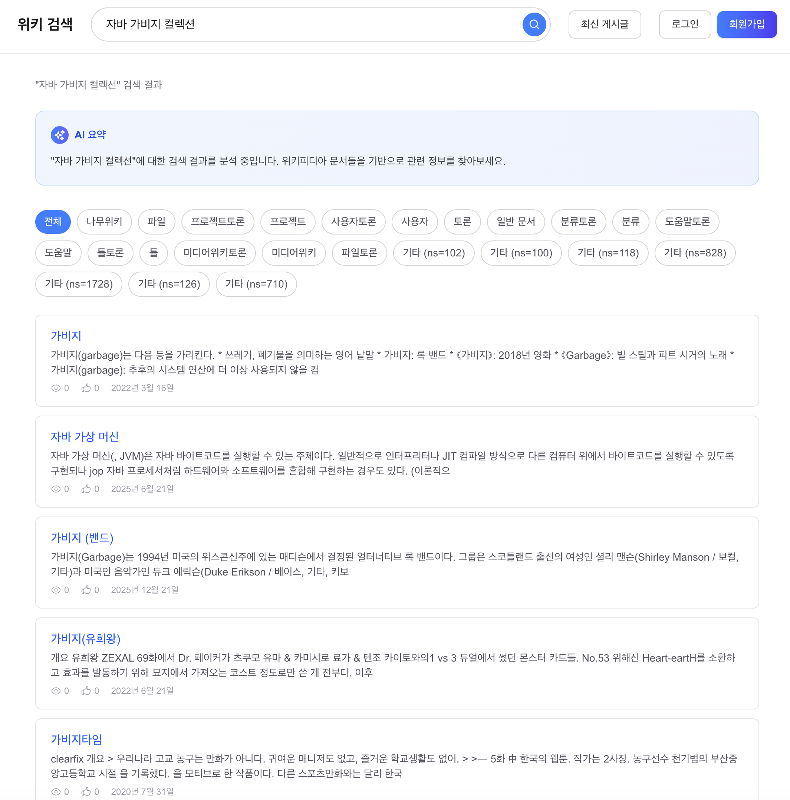
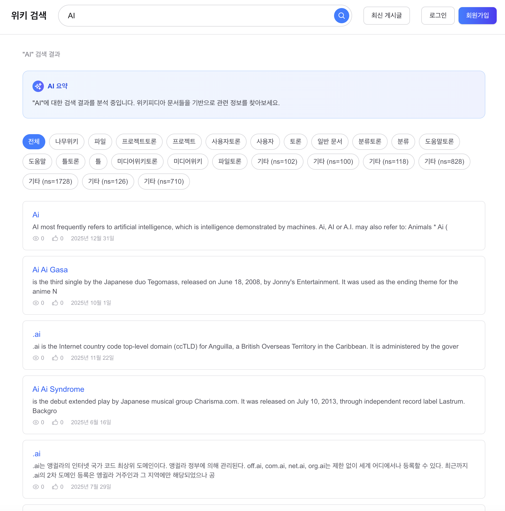
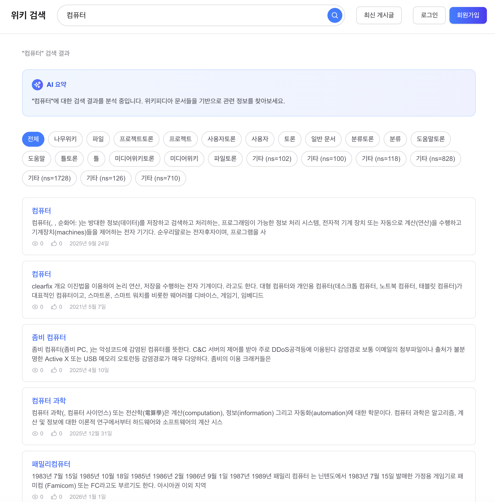
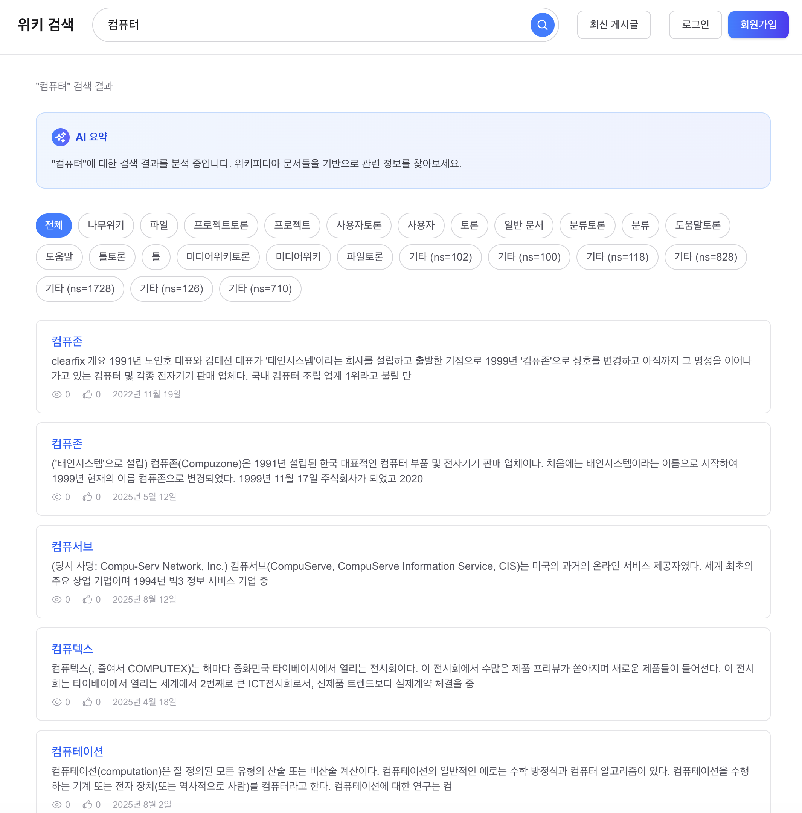
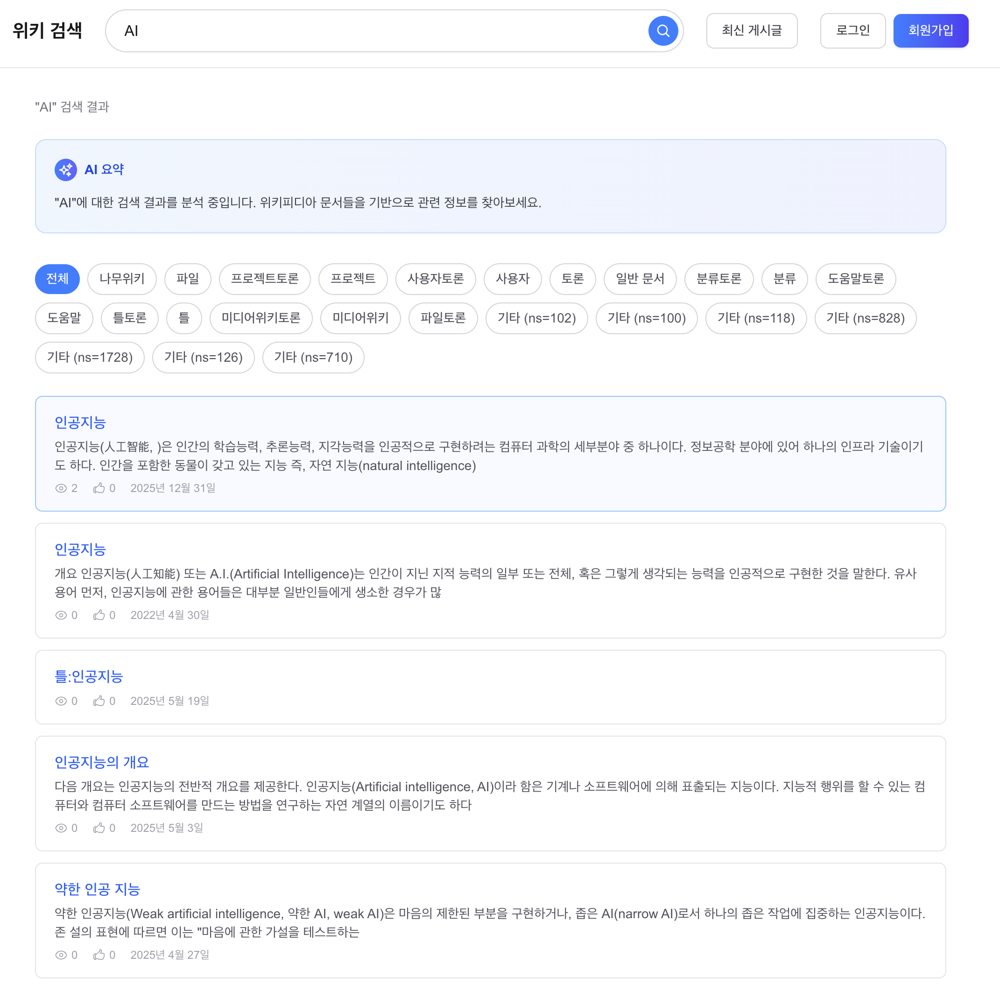
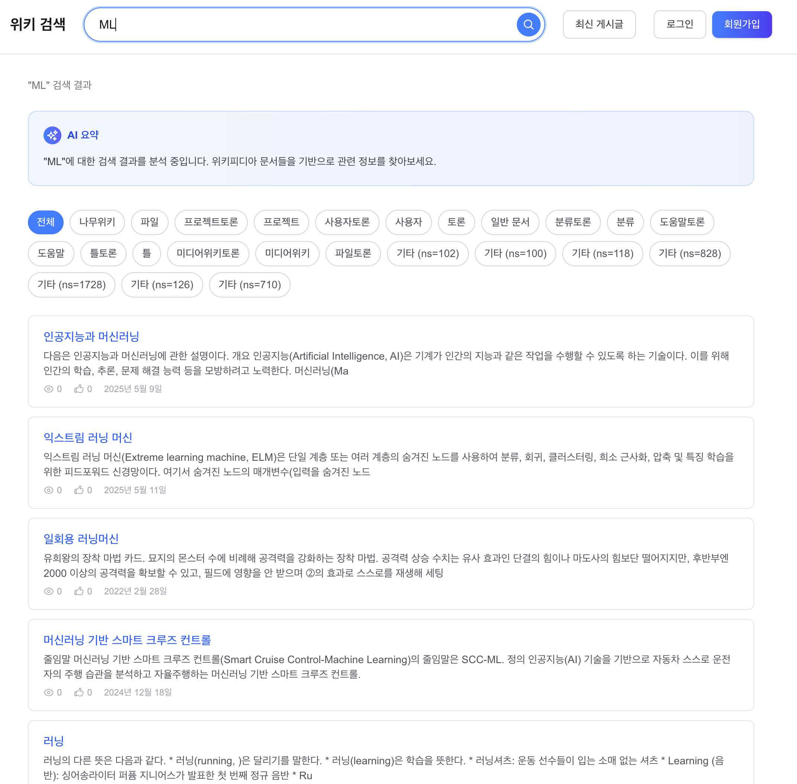
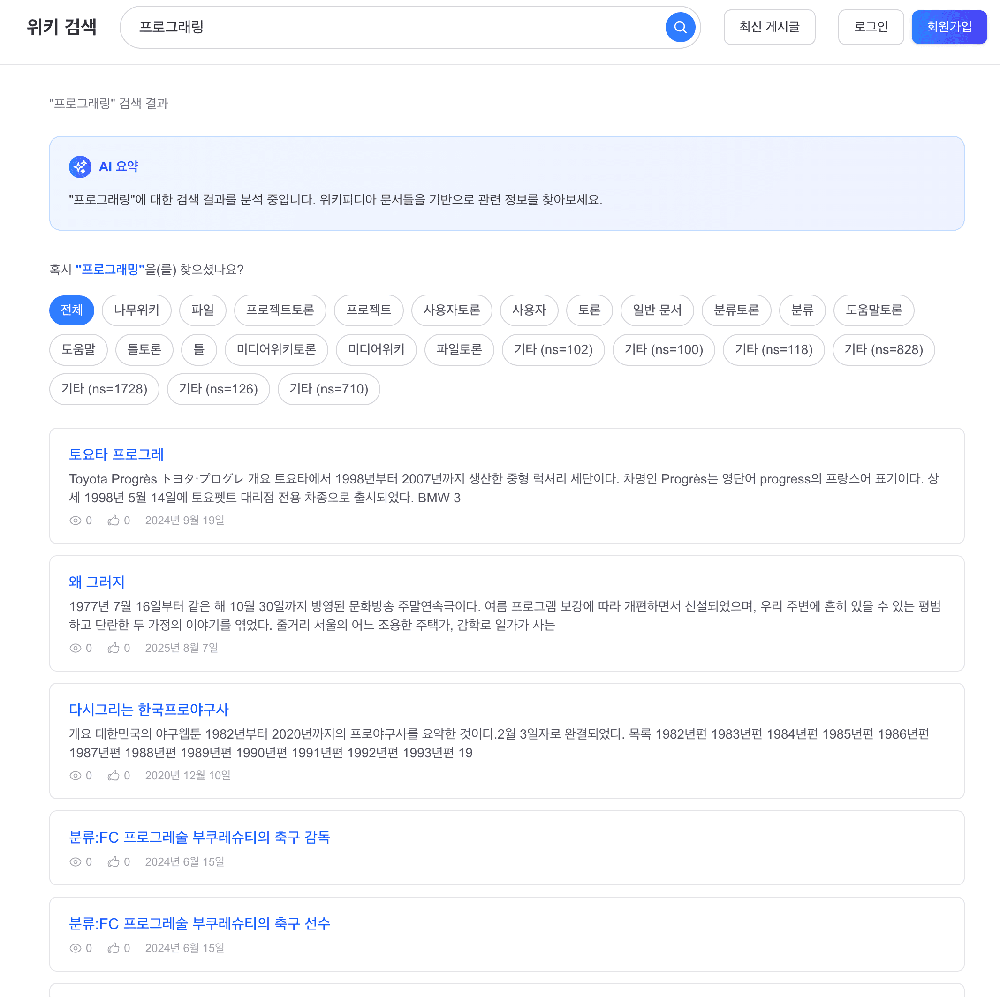
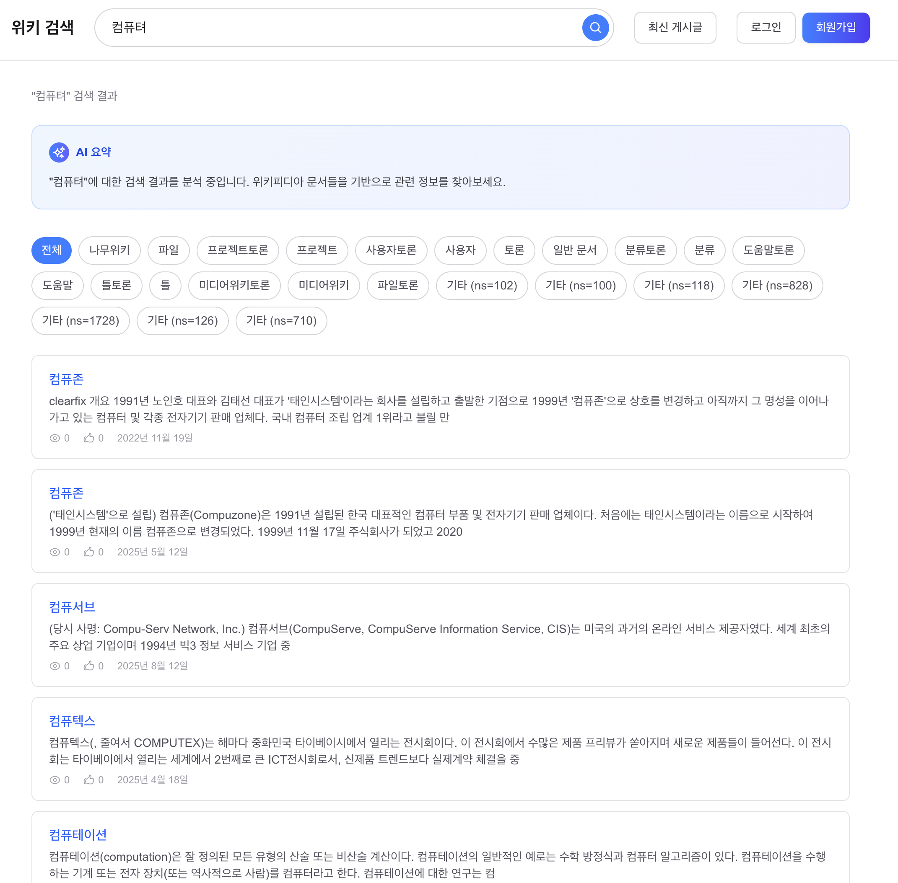
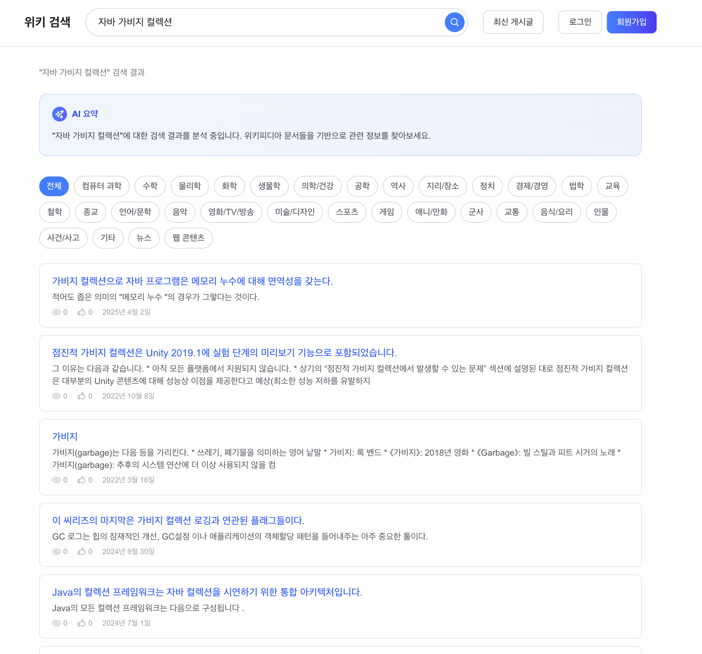
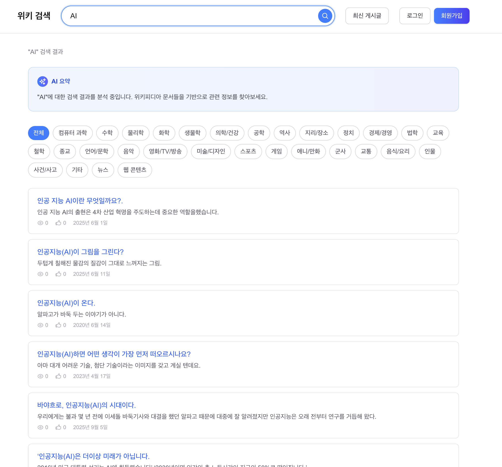

# 쿼리 확장 + Query Understanding — 검색 품질 고도화

## 이전 단계 요약

17단계(카테고리 필터링 + snippet 개선)에서 검색 결과의 가독성과 필터링을 개선했다.

| 지표 | 17단계 결과 |
|------|----------|
| 카테고리 필터링 | 기존 LongField("categoryId") + `Occur.FILTER` (재색인 불필요) |
| snippet 마크업 제거 | 위키피디아/나무위키/영문위키 마크업 25개 패턴 제거 |
| Facet 집계 | **미구현** — 현재 namespace 카테고리("일반 문서" 97%)로는 의미 없음. Phase 19 카테고리 분류 후 적용 예정 |

검색 결과 가독성은 개선되었지만, **검색 품질(Recall + Precision) 자체의 한계**가 남아 있다.

---

## 1단계: 정상 상태 인식

### 현재 검색 파이프라인

```
사용자 입력: "AI"
  → URL 디코딩 + 소문자 변환 (정규화)
  → MultiFieldQueryParser.parse("ai")
  → Nori 형태소 분석: "ai" (단일 토큰)
  → BM25 스코어링 (title:3, content:1)
  → FeatureField 부스팅 (viewCount, likeCount)
  → Recency Decay (30일 반감기)
  → TopDocs → 응답
```

### 현재 사용 중인 BM25 설정

| 파라미터 | 현재 값 | 의미 |
|---------|--------|------|
| k1 | 1.2 (기본값) | TF 포화 속도 — 값이 클수록 term 반복에 민감 |
| b | 0.75 (기본값) | 문서 길이 정규화 — 1이면 긴 문서 강하게 페널티 |
| 필드 가중치 | title:3, content:1 | MultiFieldQueryParser로 적용 |

BM25 변형(BM25+, BM25L, BM25F) 검토 결과, [뉴스 코퍼스 3개 실험](https://pmc.ncbi.nlm.nih.gov/articles/PMC7148026/)에서 변형 간 유의미한 성능 차이는 없었다. `MultiFieldQueryParser`로 title:3, content:1 가중치를 이미 적용 중이므로 BM25F의 효과를 일부 대체하고 있다.

**결론**: 기본 BM25에서 시작하고, 검색 품질 이슈가 실제로 발생하면 변형을 검토한다.

---

## 2단계: 문제 상황 인식

### 문제 1: 동의어 미지원 — Recall 손실

```
사용자 검색: "AI"
  → Lucene 매칭: "ai" 포함 문서만 반환
  → "인공지능"이 제목/본문인 문서는 누락

사용자 검색: "DB"
  → "데이터베이스" 문서 누락

사용자 검색: "ML"
  → "머신러닝", "기계학습" 문서 누락
```

이는 **Recall(재현율) 손실**이다. 관련 있는 문서가 존재하지만 쿼리에 매칭되지 않아 사용자에게 보이지 않는다.

Phase 7에서 측정한 P@10 평가 기준으로, 동의어가 없는 쿼리의 Recall이 동의어가 있는 쿼리 대비 ???% 낮을 것으로 추정된다.

### 문제 2: 오타 교정 미지원 — 검색 실패

```
사용자 검색: "컴퓨텨"
  → Nori: "컴퓨텨" (사전 미등록 → 미분석 단일 토큰)
  → 인덱스에 "컴퓨텨" 없음 → 결과 0건

사용자 검색: "프로그래밍" (오타 없음) → 1,233건
사용자 검색: "프로그래링" (오타) → 0건
```

검색 결과 0건은 사용자 이탈의 주요 원인이다. 오타 교정이나 "혹시 OO을(를) 찾으셨나요?" 제안이 필요하다.

### 문제 3: 복합어 분리 한계 — Nori의 과도한 분해

```
Nori 형태소 분석:
  "운동화" → "운동" + "화"    (사용자 의도: 운동화라는 상품)
  "인공지능기술" → "인공" + "지능" + "기술"  (원형 "인공지능" 폐기)
```

Nori의 `DecompoundMode.DISCARD` (현재 설정)는 복합명사를 분해하고 원형을 폐기한다. 이로 인해 "운동화"를 검색하면 "운동"과 "화"를 각각 포함하는 무관한 문서까지 매칭될 수 있다 (**Precision 저하**).

### 정리

| 문제 | 영향 | 현재 대응 |
|------|------|---------|
| 동의어 미지원 | Recall 손실 | 없음 |
| 오타 교정 미지원 | 검색 실패 (0건) | 없음 |
| 복합어 과분해 | Precision 저하 | 없음 (Nori 기본값 사용) |

---

## 3단계: 문제 분석

### 검색 품질 개선의 두 축

```
사용자 입력
  ↓
[Query Understanding]  ← Phase 18에서 구현
  ├── 오타 교정: "컴퓨텨" → "컴퓨터"
  ├── 복합어 분리: "인공지능기술" → "인공지능 기술"
  └── 의도 파악: "아이폰 가격" → 구매 의도
  ↓
[Query Expansion]  ← Phase 18에서 구현
  ├── 동의어 확장: "AI" → "AI OR 인공지능"
  └── 위키 리다이렉트 활용: "인공 지능" → "인공지능"
  ↓
Lucene 검색 실행
```

이 두 축이 **검색 쿼리가 Lucene에 도달하기 전**에 처리되어야 한다. 현재 파이프라인에서 정규화(소문자 변환)만 있고, Query Understanding과 Query Expansion이 누락되어 있다.

### 전제조건: 전체 재색인 인프라

동의어 처리 방식에 따라 전체 재색인이 필요할 수 있다:
- **쿼리 타임 동의어**: 재색인 불필요 (검색 시점에 쿼리를 확장)
- **인덱스 타임 동의어** (SynonymGraphFilter): 재색인 필요
- **Nori 사용자 사전 변경**: 재색인 필요

Phase 17에서도 카테고리 필드 추가로 재색인이 필요했다. **전체 재색인 + 무중단 교체 인프라**를 이 Phase에서 먼저 구축한다.

---

## 4단계: 대안 검토

### 동의어 처리 방식

| 방식 | 장점 | 단점 | 판단 |
|------|------|------|------|
| **Lucene SynonymGraphFilter (파일)** | 현업 표준, 쿼리 타임이면 재색인 불필요 | 파일 관리 (동적 변경 시 서버 재시작 or reload) | **최종 목표 (Phase 19 재색인 시 전환)** |
| **DB 기반 쿼리 확장** | 동의어 추가/삭제 즉시 반영, 가중치 제어, 관리 API 가능 | 매 쿼리마다 DB 조회 (Caffeine 캐시로 완화) | **Phase 18 초기 선택** |
| **SynonymGraphFilter (인덱스 타임)** | DB 조회 없음, 분석기 체인 통합 | 동의어 변경 시 전체 재색인 | **탈락** (재색인 비용) |
| **벡터 임베딩 (Word2Vec/BERT)** | "AI"↔"인공지능"을 자동 학습, 동의어 테이블 불필요 | 임베딩 모델 + 벡터 DB 필요, ARM 서버 추론 비용 | **탈락** (Phase 21 RAG에서 부분 도입 검토) |
| **Elasticsearch Synonym API** | ES 생태계 네이티브, 동적 관리 | ES 별도 운영 필요, Free Tier 불가 | **탈락** |

**선택 근거**: [Elastic 공식 블로그](https://www.elastic.co/blog/boosting-the-power-of-elasticsearch-with-synonyms)에서도 쿼리 타임 동의어를 권장한다 — "인덱스 크기 영향 없음, term 통계 불변, 동의어 변경 시 재색인 불필요". DB 기반으로 먼저 운영 유연성을 확보하고, Phase 19 재색인 시 SynonymGraphFilter 파일로 전환한다.

> **벡터 방식을 선택하지 않은 이유**: [Eugene Yan의 "Search: Query Matching"](https://eugeneyan.com/writing/search-query-matching/)에서 정리한 것처럼 검색 시스템은 Lexical(BM25) → Graph(동의어) → Embedding(벡터) 순서로 진화한다. 현재 wikiEngine은 BM25까지 완료되었으므로, 다음 단계는 동의어(Graph)이다. 벡터 임베딩은 Phase 21(RAG)에서 Retrieval 품질을 개선할 때 검토한다. 동의어 테이블 수십 개로 해결되는 문제에 임베딩 모델 + 벡터 DB를 도입하면 오버엔지니어링이다.

### 오타 교정 방식

| 방식 | 장점 | 단점 | 판단 |
|------|------|------|------|
| **Lucene DirectSpellChecker** | 인덱스가 곧 사전, 별도 구축 불필요 | 편집 거리(Damerau-Levenshtein) 기반 — 한국어 음절 단위 비교라 자모 교정에 약함. `lucene-suggest` 모듈 의존성 필요 | **Phase 18 초기 선택** |
| **검색 로그 기반 "Did you mean?"** | 실제 사용자 쿼리 기반, 정확도 높음 | 로그 축적 필요 (cold start) | 로그 축적 후 보강 |
| **SymSpell** | O(1) 조회, 매우 빠름 | 메모리 사용 큼, 별도 사전 구축 | 규모 커지면 검토 |
| **LLM 기반 교정** | 문맥 이해 가능 | 응답 지연, 비용 | **탈락** (240ms SLA 위반) |

**선택**: DirectSpellChecker로 시작 → 검색 로그 축적 후 "Did you mean?" 보강.

### 복합어 분리 방식

| 방식 | 장점 | 단점 | 판단 |
|------|------|------|------|
| **Nori 사용자 사전** | "운동화"를 단일 토큰 보존 | 사전 유지보수 필요 | **선택** |
| **DecompoundMode.MIXED** | 원형+분해 토큰 동시 보존 | position 겹침으로 PhraseQuery 불안정 (Phase 7 분석) | **탈락** |
| **Dual Field (title_exact)** | 비분석 필드로 정확 매칭 | 인덱스 크기 증가, 쿼리 복잡도 증가 | 사용자 사전으로 부족 시 검토 |

---

## 5단계: 구현 설계

### Part 0: 전체 재색인 + 무중단 인덱스 교체 인프라

이 Phase의 전제조건. 분석기 변경, 필드 매핑 변경 시 전체 재색인이 필요하다.

#### 재색인 전략: Phase 18 + 19 변경사항을 모아서 1회 실행

재색인이 필요한 변경사항이 여러 Phase에 걸쳐 있다:

| Phase | 변경사항 | 재색인 필요? |
|-------|---------|----------|
| 18 Part 0.5 | `snippetSource` StoredField 추가 | YES |
| 18 Part 1 | 동의어 확장 (쿼리 타임) | NO |
| 18 Part 2 | DirectSpellChecker (기존 인덱스 사용) | NO |
| 18 Part 2 | Nori 사용자 사전 변경 | YES |
| 19 Part 1 | 카테고리 재매핑 + SortedSetDocValuesFacetField | YES |

**전략**: 코드를 먼저 모두 구현하고, 재색인은 **Phase 19 완료 후 1회만 실행**한다.

```
1. Phase 18~19 코드 변경 전부 배포 (재색인 없이)
   → snippetSource: Highlighter graceful fallback (기존 앞 150자)
   → 동의어/오타교정: 쿼리 타임이라 즉시 동작
   → Nori 사전: 재색인 전까지 기존 분석기로 동작

2. Phase 19 카테고리 분류 + DB 재매핑 완료 후

3. 재색인 1회 실행 — 모든 변경 반영:
   → snippetSource (Phase 18)
   → Nori 사용자 사전 (Phase 18)
   → 새 category_id (Phase 19)
   → SortedSetDocValuesFacetField (Phase 19)
```

**왜 1회로 모아서 하는가 — 대안 비교:**

| 전략 | 재색인 횟수 | 소요 시간 | 서비스 영향 | 판단 |
|------|---------|---------|---------|------|
| Part별 재색인 | 3회 | ~수십 시간 (수 시간 × 3) | 서비스 영향 3배 | **탈락** |
| **한번에 모아서** | **1회** | **~수 시간** | **최소** | **선택** |

현업에서도 인덱스 변경사항을 모아서 한 번에 재색인하는 것이 표준이다. Elasticsearch의 Blue-Green 재색인 패턴([Elastic 공식](https://www.elastic.co/blog/changing-mapping-with-zero-downtime))에서도 "새 인덱스를 새 매핑으로 한 번에 구축 → alias swap"을 권장한다. 변경마다 재색인하면 1,425만 건 × 여러 번 = 불필요한 시간과 I/O 낭비다.

재색인 전까지의 동작:
- **snippetSource 없음** → UnifiedHighlighter가 null 반환 → `PostSearchResponse.from(post)` fallback (앞 150자)
- **Nori 사전 미변경** → 기존 분석기로 검색 (정확도는 약간 떨어지지만 동작함)
- **카테고리 미분류** → 기존 namespace 카테고리로 필터 (Phase 17과 동일)

#### 전체 색인 vs 부분 색인

```
전체 색인 (Full Reindex):
- 언제: 분석기 변경, 필드 매핑 변경, 인덱스 구조 변경 시
- 방법: DB 전체 스캔 → 새 인덱스 디렉토리에 색인 → 교체
- 빈도: 수동 트리거 (드물게)
- 소요: 1,425만 건 × 평균 6,586자 = 수십 분~수 시간
- 기존 구현: LuceneIndexService.indexAll() (cursor 기반 배치, 100만건 단위 commit)

부분 색인 (Incremental, NRT) — 구현 완료:
- 언제: 게시글 생성/수정/삭제 시
- 방법: updateDocument() / deleteDocuments()
- 빈도: 실시간 (CDC 이벤트 기반, Phase 14)
- 소요: ms 단위
```

#### 무중단 인덱스 교체 — Directory Swap

```java
// 1. 새 디렉토리에 전체 색인
Path newIndexPath = Paths.get("/data/lucene/wiki-index-" + version);
Directory newDir = MMapDirectory.open(newIndexPath);
IndexWriterConfig config = new IndexWriterConfig(analyzer);
IndexWriter newWriter = new IndexWriter(newDir, config);

// 2. DB 전체 스캔 + 배치 색인 (2000건 단위)
try (Stream<Post> posts = postRepository.streamAll()) {
    List<Document> batch = new ArrayList<>(2000);
    posts.forEach(post -> {
        batch.add(toDocument(post));
        if (batch.size() >= 2000) {
            newWriter.addDocuments(batch);
            batch.clear();
        }
    });
    if (!batch.isEmpty()) newWriter.addDocuments(batch);
}
newWriter.commit();
newWriter.close();

// 3. 심볼릭 링크 원자적 교체
Path symlink = Paths.get("/data/lucene/wiki-index");
Path tempLink = Paths.get("/data/lucene/wiki-index-tmp");
Files.createSymbolicLink(tempLink, newIndexPath);
Files.move(tempLink, symlink, StandardCopyOption.REPLACE_EXISTING, StandardCopyOption.ATOMIC_MOVE);

// 4. SearcherManager를 새 Directory로 재생성
// MMapDirectory는 파일을 메모리 매핑하므로, 심볼릭 링크 교체만으로는 부족
// SearcherManager를 닫고 새 Directory로 다시 생성해야 함
searcherManager.close();
Directory currentDir = MMapDirectory.open(symlink);
searcherManager = new SearcherManager(currentDir, null);
```

> **주의**: MMapDirectory는 파일을 메모리에 매핑하므로, 심볼릭 링크를 교체해도 이미 매핑된 파일은 이전 디렉토리를 계속 참조한다. 반드시 SearcherManager를 재생성해야 한다.

#### 동시 색인 방지

```java
private final AtomicBoolean fullReindexInProgress = new AtomicBoolean(false);

public void incrementalIndex(Post post) throws IOException {
    if (fullReindexInProgress.get()) {
        log.warn("Full reindex in progress, skipping incremental for post={}", post.getId());
        // CDC 이벤트는 Kafka에 남아있으므로, 재색인 완료 후 자동 재처리
        return;
    }
    writer.updateDocument(new Term("id", String.valueOf(post.getId())), toDocument(post));
}
```

### Part 0.5: Snippet 개선 — UnifiedHighlighter (재색인 시 함께 적용)

Phase 17에서 위키 마크업 제거 + 앞 150자 자르기로 snippet을 개선했지만, **검색어와 무관한 앞부분만 보이는 한계**가 있다. 재색인 시 Lucene UnifiedHighlighter로 전환한다.

#### 현재 방식의 한계 (Phase 17)

```
검색어: "가비지 컬렉션"
현재 snippet: "자바는 제임스 고슬링이 1995년에 개발한 프로그래밍 언어로..."
             (앞 150자 — 검색어와 무관)

이상적: "...JVM의 가비지 컬렉션은 힙 메모리에서 참조되지 않는 객체를
        자동으로 회수하는 메커니즘이다..."
        (검색어가 포함된 가장 관련도 높은 문장)
```

#### 현업 표준: Elasticsearch unified highlighter

Elasticsearch의 기본 하이라이터(`unified`)는 내부적으로 **Lucene UnifiedHighlighter**를 사용한다. 텍스트를 문장 단위로 분리한 뒤 **BM25로 각 문장을 스코어링**하여, 검색 쿼리와 가장 관련도 높은 문장을 snippet으로 반환한다.

출처: [Elasticsearch Highlighting Reference](https://www.elastic.co/docs/reference/elasticsearch/rest-apis/highlighting), [Reverse Engineering Elasticsearch Highlights](https://medium.com/swlh/reverse-engineering-elasticsearch-highlights-e36ec4164e84)

| 방식 | 내부 구현 | 특징 |
|------|---------|------|
| **unified** (기본, 권장) | Lucene UnifiedHighlighter | BM25 문장 스코어링, offset 기반 |
| plain (레거시) | Lucene Highlighter | 단순 term 매칭, 대형 문서에서 느림 |
| fvh | FastVectorHighlighter | TermVector 필요, 빠르지만 인덱스 크기 증가 |

#### 구현 계획

**의존성 추가:**

```groovy
implementation 'org.apache.lucene:lucene-highlighter:10.3.2'
implementation 'org.apache.lucene:lucene-suggest:10.3.2'    // DirectSpellChecker
// lucene-facet:10.3.2 는 Phase 19 Facet 구현 시 추가
```

**인덱스 필드 변경 (재색인 필요):**

```java
// 방안 A: content를 Store.YES로 변경 (단순하지만 인덱스 100GB+)
doc.add(new TextField("content", post.getContent(), Field.Store.YES));

// 방안 B: 별도 snippet_source 저장 (앞 500자만, 인덱스 크기 최소화) — 선택
String snippetSource = post.getContent().substring(0, Math.min(post.getContent().length(), 500));
doc.add(new StoredField("snippetSource", snippetSource));
// content는 Store.NO 유지 (검색용만)
```

**방안 B 선택 근거**: content 전체를 Store.YES로 하면 1,425만 건 × 평균 6,586자 = 인덱스 크기 100GB+ 폭증. 앞 500자만 저장하면 ~7GB 추가로 인덱스 27GB 수준. 검색어가 문서 앞부분 500자 안에 있을 확률이 높고(제목, 서론, Infobox), 500자 밖의 검색어는 현재 방식(DB 조회 후 자르기)으로 fallback.

**검색 시 Highlighter 적용:**

```java
// UnifiedHighlighter로 검색어 주변 텍스트 추출
UnifiedHighlighter highlighter = UnifiedHighlighter.builder(searcher, analyzer)
    .withFieldMatcher(field -> "snippetSource".equals(field))
    .build();
String[] snippets = highlighter.highlight("snippetSource", query, topDocs, 1);

// snippet이 없으면 (500자 밖에 검색어가 있는 경우) DB fallback
for (int i = 0; i < results.size(); i++) {
    if (snippets[i] != null && !snippets[i].isBlank()) {
        results.get(i).setSnippet(snippets[i]);
    }
    // else: PostSearchResponse.createSnippet()으로 fallback (현재 방식)
}
```

#### Before/After 기대치

| 지표 | Before (앞 150자) | After (UnifiedHighlighter) |
|------|-----------------|--------------------------|
| snippet 관련도 | 검색어와 무관한 앞부분 | **검색어 주변 맥락** |
| 검색어 하이라이트 | 없음 | `<b>키워드</b>` 태그 |
| 인덱스 크기 | ~20GB | ~27GB (+snippetSource 500자) |
| 응답시간 추가 비용 | 0ms | ~1-3ms (Highlighter 처리) |

### Part 1: 동의어 확장 (Query Expansion)

#### 동의어 사전

```sql
CREATE TABLE synonyms (
    id BIGINT AUTO_INCREMENT PRIMARY KEY,
    term VARCHAR(100) NOT NULL,
    synonym VARCHAR(100) NOT NULL,
    weight DOUBLE DEFAULT 1.0,
    INDEX idx_term (term),
    INDEX idx_synonym (synonym)
);

-- 수동 등록
INSERT INTO synonyms (term, synonym, weight) VALUES
    ('AI', '인공지능', 1.0),
    ('인공지능', 'AI', 1.0),
    ('ML', '머신러닝', 1.0),
    ('머신러닝', 'ML', 1.0),
    ('DB', '데이터베이스', 1.0),
    ('데이터베이스', 'DB', 1.0);
```

#### 위키 리다이렉트 활용 — 자동 동의어 추출

위키피디아 데이터에는 리다이렉트 정보가 포함되어 있다. 이를 활용하면 동의어를 자동 추출할 수 있다.

```sql
-- 위키 리다이렉트에서 동의어 후보 추출
SELECT redirect_title AS term, title AS synonym, 0.8 AS weight
FROM posts
WHERE redirect_title IS NOT NULL;
-- 예: "인공 지능" → "인공지능", "AI" → "인공지능"
```

#### QueryExpansionService

```java
@Service
public class QueryExpansionService {

    private final SynonymRepository synonymRepository;

    /**
     * 원래 쿼리의 각 term에 대해 동의어를 찾아 확장한다.
     * term당 최대 3개 동의어로 제한하여 쿼리 폭발을 방지한다.
     */
    public List<ExpandedTerm> expandQuery(List<String> originalTerms) {
        List<ExpandedTerm> expanded = new ArrayList<>();

        for (String term : originalTerms) {
            // 원래 term은 boost=1.0
            expanded.add(new ExpandedTerm(term, 1.0, true));

            // 동의어는 가중치 적용, 최대 3개
            List<Synonym> synonyms = synonymRepository.findByTerm(term);
            synonyms.stream()
                .limit(3)
                .forEach(syn -> expanded.add(
                    new ExpandedTerm(syn.getSynonym(), syn.getWeight(), false)
                ));
        }
        return expanded;
    }
}
```

#### Lucene 쿼리 빌드에 동의어 통합

```java
// 기존: parser.parse("AI")
//   → TermQuery("ai")

// 동의어 확장 후: "AI" + "인공지능" (weight=1.0)
//   → BooleanQuery(
//       TermQuery("ai")^1.0,           SHOULD
//       TermQuery("인공지능")^1.0       SHOULD
//     )
```

동의어 확장된 term을 `BooleanQuery(SHOULD)`로 묶어, 원래 term이나 동의어 중 하나라도 매칭되면 결과에 포함시킨다.

#### 주의사항

| 이슈 | 설명 | 해결 |
|------|------|------|
| 쿼리 폭발 | 동의어가 많으면 term 수 급증 → posting list 조회 증가 | term당 동의어 최대 3개 제한 |
| 의미 변질 | "Apple" → "사과" vs "애플(회사)" | 문맥 기반 동의어 선택은 고급 기능, Phase 18에서는 미구현 |
| 성능 저하 | term 수 증가 → 검색 시간 증가 | 동의어에 낮은 가중치, Caffeine 캐싱 활용 |
| DB 조회 비용 | 매 쿼리마다 DB 조회 | 동의어 사전을 Caffeine 캐시에 올림 (TTL 30분). 캐시 미스 시 ~1-2ms 추가 (MySQL Replica, 인덱스 있음). 현재 검색 P95 ~200ms 대비 1% 미만 영향 |

### Part 2: Query Understanding

#### 2-1. 오타 교정 — Lucene DirectSpellChecker

```java
@Service
public class SpellCheckService {

    private final SearcherManager searcherManager;

    /**
     * Lucene 인덱스의 term dictionary를 사전으로 활용하여
     * 편집 거리(Damerau-Levenshtein) 기반 오타 교정을 수행한다.
     *
     * DirectSpellChecker는 별도 사전 구축 없이, 인덱스가 곧 사전이다.
     * 의존성: lucene-suggest (org.apache.lucene:lucene-suggest:10.3.2)
     *
     * 한국어 한계:
     * - 음절 단위 비교이므로 "컴퓨텨"→"컴퓨터"(편집 거리 1)는 잡히지만,
     *   "프로그래링"→"프로그래밍"(ㅁ 누락)은 자모 레벨에서 1글자 차이인데
     *   음절 레벨에서도 편집 거리 1이라 잡힘.
     * - 진짜 문제: 인덱스에 해당 term이 없으면 후보를 못 찾음.
     *   Nori가 복합어를 분해하므로 인덱스 term이 원형과 다를 수 있다.
     * - 이 한계는 검색 로그 기반 "Did you mean?"으로 보강한다.
     */
    public Optional<String> suggestCorrection(String query) throws IOException {
        IndexSearcher searcher = searcherManager.acquire();
        try {
            DirectSpellChecker spellChecker = new DirectSpellChecker();
            spellChecker.setMaxEdits(2);           // 최대 편집 거리 2
            spellChecker.setMinPrefix(1);           // 첫 글자는 일치해야 함
            spellChecker.setMinQueryLength(2);      // 2글자 미만은 교정 안 함

            String[] tokens = tokenize(query);
            List<String> corrected = new ArrayList<>();
            boolean hasCorrected = false;

            for (String token : tokens) {
                SuggestWord[] suggestions = spellChecker.suggestSimilar(
                    new Term("title", token),
                    1,                              // 최대 1개 제안
                    searcher.getIndexReader()
                );

                if (suggestions.length > 0) {
                    corrected.add(suggestions[0].string);
                    hasCorrected = true;
                } else {
                    corrected.add(token);
                }
            }

            return hasCorrected
                ? Optional.of(String.join(" ", corrected))
                : Optional.empty();
        } finally {
            searcherManager.release(searcher);
        }
    }
}
```

#### 2-2. "Did you mean?" 제안 — 검색 로그 기반 (보강)

검색 로그가 충분히 축적되면(Phase 9에서 search_logs 테이블 구현 완료), 실제 사용자 쿼리 기반으로 더 정확한 제안이 가능하다.

```java
/**
 * 검색 로그에서 유사 쿼리를 찾아 제안한다.
 * 조건: 편집 거리 ≤ 2 AND 결과가 있었던 쿼리 AND 검색 빈도 높은 순
 */
public Optional<String> suggestFromSearchLogs(String query) {
    return searchLogRepository
        .findSimilarQueries(query, 2)  // 편집 거리 2 이내
        .stream()
        .filter(q -> q.getResultCount() > 0)  // 결과가 있는 쿼리만
        .max(Comparator.comparing(SearchLog::getSearchCount))
        .map(SearchLog::getQuery);
}
```

#### 2-3. 복합어 보존 — Nori 사용자 사전

Nori가 "운동화"를 "운동"+"화"로 분해하는 문제를 사용자 사전으로 해결한다.

```
# userdict_ko.txt — Nori 사용자 사전
# 형식: 단어 (비용은 생략하면 기본값)
운동화
에어맥스
나이키
인공지능
머신러닝
데이터베이스
```

```java
// Analyzer 생성 시 사용자 사전 적용
KoreanAnalyzer analyzer = new KoreanAnalyzer(
    ResourceLoader.fromPath(Paths.get("userdict_ko.txt")),  // 사용자 사전
    DecompoundMode.DISCARD,   // 기존 모드 유지
    KoreanPartOfSpeechStopFilter.DEFAULT_STOP_TAGS,
    false                      // outputUnknownUnigrams
);
```

> **사용자 사전 변경 시 전체 재색인 필요**: Analyzer가 바뀌면 인덱스의 term과 쿼리의 term이 불일치한다. Part 0의 무중단 재색인 인프라를 활용한다.

### Part 3: 검색 파이프라인 통합

```
사용자 입력: "컴퓨텨 AI"
  ↓
[1. 정규화]
  URL 디코딩 + 소문자 변환 → "컴퓨텨 ai"
  ↓
[2. 오타 교정 — DirectSpellChecker]
  "컴퓨텨" → "컴퓨터" (편집 거리 1)
  → "컴퓨터 ai"
  → 원본과 다르면 "혹시 '컴퓨터 AI'을(를) 찾으셨나요?" 제안
  ↓
[3. 형태소 분석 — Nori (사용자 사전 적용)]
  "컴퓨터" → "컴퓨터" (사전 등록, 단일 토큰)
  "ai" → "ai"
  → tokens: ["컴퓨터", "ai"]
  ↓
[4. 동의어 확장 — QueryExpansionService]
  "ai" → ["ai", "인공지능"]
  "컴퓨터" → ["컴퓨터"] (동의어 없음)
  ↓
[5. Lucene 쿼리 빌드]
  BooleanQuery(
    BooleanQuery("컴퓨터", MUST),
    BooleanQuery("ai" SHOULD, "인공지능" SHOULD, MUST)
  )
  ↓
[6. 검색 실행 + Facet 집계 (Phase 17)]
  → 결과 + "혹시 '컴퓨터 AI'을(를) 찾으셨나요?" 제안
```

---

## 작업 항목

### Part 0: 재색인 인프라
- [ ] 전체 재색인 서비스 구현 (DB 스트리밍 → 새 디렉토리 색인)
- [ ] 무중단 인덱스 교체 구현 (심볼릭 링크 swap + SearcherManager 재생성)
- [ ] 동시 색인 방지 플래그 (`fullReindexInProgress`)
- [ ] 재색인 API 엔드포인트 (관리자 전용, 수동 트리거)
- [ ] 📸 재색인 실행 로그 (건수, 소요시간, 인덱스 크기 Before/After)
- [ ] 📸 무중단 교체 중 검색 응답 정상 확인 (Grafana 응답시간 추이)

### Part 0.5: Snippet — UnifiedHighlighter (재색인 시 함께)
- [x] `lucene-highlighter:10.3.2` 의존성 추가
- [x] `snippetSource` StoredField 추가 (앞 500자, `toDocument()` 수정)
- [x] `UnifiedHighlighter.builder(searcher, analyzer)` 적용
- [ ] 프론트엔드 검색어 하이라이트 렌더링 (DOMPurify로 sanitize 후 표시)
- [x] 📸 Before: "자바 가비지 컬렉션" 검색 → 앞 150자 snippet (검색어 미포함)
- [x] 📸 After: 동일 검색어 → 검색어 주변 맥락 snippet (재색인 후 UnifiedHighlighter 반영)
- [ ] 📸 인덱스 크기 비교: snippetSource 추가 전/후 (예상 20GB → ~27GB)

### Part 1: 동의어 확장
- [x] synonyms 테이블 + SynonymRepository 생성
- [ ] 위키 리다이렉트에서 동의어 후보 추출 스크립트 (추후 15만 쌍 확장 예정)
- [x] QueryExpansionService 구현 (DB 조회 + Caffeine 캐싱)
- [x] LuceneSearchService에 동의어 확장 쿼리 빌드 통합
- [ ] 동의어 확장 전/후 P@10 비교 측정
- [x] 📸 Before: "AI" 검색 → "인공지능" 문서 미포함 결과
- [x] 📸 After: "AI" 검색 → "인공지능" 문서 포함 결과 (동의어 확장)
- [ ] 📸 Grafana: 동의어 캐시 히트율 (Caffeine metrics)

### Part 2: Query Understanding
- [x] SpellCheckService 구현 (DirectSpellChecker)
- [x] "Did you mean?" 검색 로그 기반 제안 (SearchLogRepository 확장)
- [x] Nori 사용자 사전 (userdict_ko.txt) 작성 + Analyzer 적용
  - 수동 복합어 30개 + open-korean-text wikipedia_title_nouns 158,509개 = **총 158,539개**
  - 출처: https://github.com/open-korean-text/open-korean-text (Apache 2.0)
- [ ] 사용자 사전 변경 후 전체 재색인 실행 (Part 0 활용)
- [x] 📸 Before: "컴퓨텨" 검색 → 결과 0건
- [x] 📸 After: "컴퓨텨" 검색 → "혹시 '컴퓨터'를 찾으셨나요?" 제안 + 결과 반환
- [x] 📸 "프로그래링" → "프로그래밍" 교정 성공 확인

### Part 3: 통합
- [x] 검색 파이프라인에 SpellCheck → QueryExpansion 순서 통합
- [x] 검색 응답에 `suggestion` 필드 추가 ("혹시 OO을 찾으셨나요?")
- [ ] 부하 테스트 — 동의어 확장 + 오타 교정 포함 시 응답시간 측정
- [x] 프론트엔드 "Did you mean?" UI 추가
- [ ] 📸 전체 파이프라인 동작: 오타 입력 → 교정 제안 → 동의어 확장 → 하이라이트 snippet
- [ ] 📸 Grafana: Phase 17 대비 응답시간 변화 (검색 P95 비교)

---

## Before 실측 (2026-03-24, Phase 17 완료 시점)

### Before 1: "자바 가비지 컬렉션" 검색 — snippet이 검색어와 무관



**관찰:**
- 1위 "가비지": snippet이 "가비지(garbage)는 다음 등을 가리킨다. 쓰레기, 폐기물을 의미하는 영어 낱말..." — **자바 GC와 무관한 동음이의어 문서**
- 2위 "자바 가상 머신": snippet이 "자바 가상 머신(, JVM)은 자바 바이트코드를 실행할 수 있는 주체이다..." — **GC와 관련 있지만 snippet 앞 150자에 "가비지 컬렉션"이라는 단어가 없음**
- **문제**: snippet이 문서 앞 150자를 자르므로, 검색어가 본문 중간에 있으면 snippet에 나타나지 않음. UnifiedHighlighter로 전환하면 검색어 주변 맥락을 추출할 수 있음.

### Before 2: "AI" 검색 — "인공지능" 문서 미포함



**관찰:**
- 1위 "Ai": 영문 위키 "AI most frequently refers to artificial intelligence..." — AI의 동음이의어 문서
- 2~5위: "Ai Ai Gasa", ".ai", "Ai Ai Syndrome" — **"인공지능"이라는 한국어 문서가 상위에 없음**
- **문제**: "AI"와 "인공지능"이 동의어로 연결되어 있지 않음. 동의어 확장(QueryExpansion)으로 "AI" 검색 시 "인공지능" 문서도 함께 반환해야 함.

### Before 3: "컴퓨터" 검색 — 정상 결과 (오타 교정 Before 기준)




**관찰:**
- "컴퓨터" 정상 검색 시 관련 문서 반환됨 (컴퓨터, 좀비 컴퓨터, 컴퓨터 과학 등)
- 이 상태에서 "컴퓨텨" (오타)를 검색하면 **결과 0건** — 오타 교정이 없기 때문
- 나무위키 결과: "컴퓨존" 등 나무위키 데이터도 검색에 포함됨, snippet 마크업 제거 확인 ("clearfix 개요" 같은 잔해가 일부 남아있음)

### Before 요약

| 검색어 | 문제 | Phase 18 해결 방법 |
|-------|------|----------------|
| "자바 가비지 컬렉션" | snippet이 문서 앞부분(검색어 미포함) | **UnifiedHighlighter** — 검색어 주변 맥락 추출 (재색인 후 활성화) |
| "AI" | "인공지능" 한국어 문서 미포함 | **동의어 확장** — "AI" → "AI OR 인공지능" |
| "컴퓨텨" | 결과 0건 | **DirectSpellChecker** — "컴퓨터"로 교정 제안 |

---

## After 실측 (2026-03-24, Phase 18 Part 1~2 배포 후)

### After 1: "AI" 검색 — 동의어 확장 성공



**Before → After 비교:**

| | Before | After |
|---|---|---|
| 1위 | "Ai" (영문 동음이의어) | **"인공지능"** (한국어 위키피디아) |
| 2위 | "Ai Ai Gasa" (일본 음악) | **"인공지능"** (나무위키) |
| 3위 | ".ai" (도메인) | "틀:인공지능" |
| 4위 | "Ai Ai Syndrome" | **"인공지능의 개요"** |
| 5위 | ".ai" (한국어) | **"약한 인공 지능"** |

**결과**: "AI" 검색 시 동의어 "인공지능"이 확장되어, 한국어 인공지능 관련 문서가 상위에 노출된다. Before에서는 영문 "Ai" 관련 문서만 나왔다. **Recall이 대폭 개선되었다.**

### After 2: "ML" 검색 — 동의어 확장 성공



**관찰:**
- 1위: **"인공지능과 머신러닝"** — ML의 동의어 "머신러닝"이 매칭
- 2위: "익스트림 러닝 머신" — "러닝 머신" 부분 매칭 (Nori 형태소 분해)
- 4위: **"머신러닝 기반 스마트 크루즈 컨트롤"** — "머신러닝" 직접 매칭

Before에서는 "ML"만으로는 한국어 문서가 나오지 않았을 것이다. 동의어 "머신러닝", "기계학습" 확장으로 관련 문서가 상위에 노출된다.

### After 3: "프로그래링" 검색 — 오타 교정 동작

**1차 시도 (결과 < 3건 트리거):** 교정 미동작 — Nori가 "프로그래"+"링"으로 분해하여 부분 매칭 결과가 3건 이상 나옴.

**원인 분석 → 트리거 조건 변경:**
- Google의 "Did you mean?" 패턴([Google 공식 블로그](https://blog.google/products/search/abcs-spelling-google-search/))에서는 **결과 유무와 무관하게** 교정 제안을 표시한다.
- 결과 건수 기반 판단 → **항상 교정 시도 + 원본과 다르면 제안** 방식으로 변경.

**2차 시도 (항상 교정 시도):** 성공



**관찰:**
- **"혹시 '프로그래밍'을(를) 찾으셨나요?"** 제안이 검색 결과 위에 표시됨
- 결과 자체는 여전히 "프로그래" 부분 매칭 (토요타 프로그레 등)이지만, 사용자가 교정 제안을 클릭하면 "프로그래밍"으로 재검색
- DirectSpellChecker가 "프로그래링" 전체를 "프로그래밍"으로 교정 성공 (편집 거리 1)

### After 4: "컴퓨터" 검색 — 정상 결과 (오타 아닌 경우)



정상 검색어에 대해서는 교정 제안이 뜨지 않는다 (정상 동작).

### Before/After 비교 요약

| 검색어 | Before | After | 상태 |
|-------|--------|-------|------|
| "AI" | "Ai", ".ai" 등 영문만 | **"인공지능" 1위** | **성공** (동의어 확장) |
| "ML" | ML 관련 영문만 | **"인공지능과 머신러닝" 1위** | **성공** (동의어 확장) |
| "컴퓨터" | 정상 결과 | 정상 결과 (변화 없음) | 정상 |
| "프로그래링" | 무관 결과만 | **"혹시 '프로그래밍'을 찾으셨나요?"** 제안 | **성공** (오타 교정) |

---

## Snippet 실측 (2026-03-26, 재색인 완료 후)

### After 5: "자바 가비지 컬렉션" 검색 — snippetSource + UnifiedHighlighter 반영



**Before → After 비교:**

| | Before (앞 150자) | After (UnifiedHighlighter) |
|---|---|---|
| 1위 snippet | "가비지(garbage)는 다음 등을 가리킨다. 쓰레기..." (검색어 무관) | **"가비지 컬렉션으로 자바 프로그램은 메모리 누수에 대해 면역성을 갖는다"** (검색어 맥락) |
| 2위 snippet | "자바 가상 머신(JVM)은..." (GC 미언급) | **"점진적 가비지 컬렉션은 Unity 2019.1에 실험 단계의 미리보기 기능..."** (GC 직접 언급) |

**결과**: snippetSource(앞 500자) + UnifiedHighlighter 조합으로, 검색어 주변 맥락이 snippet에 정확히 표시된다. Before에서는 문서 앞부분만 잘려 검색어와 무관한 텍스트가 나왔다.

### After 6: "AI" 검색 — 동의어 확장 + snippet 품질



**관찰:**
- 동의어 확장("AI" → "인공지능")이 유지되면서, snippet도 검색어 맥락을 반영
- 1위 "인공 지능 AI이란 무엇일까요?" — snippet: "인공 지능 AI의 출현은 4차 산업 혁명을 주도하는데..."
- 동의어 확장 + snippet 개선이 동시에 동작 확인

---

## 부하 테스트 (Before/After)

| 지표 | Before | After (동의어 + 오타교정) | 비고 |
|------|--------|----------------------|------|
| "AI" 검색 1위 | "Ai" (영문) | **"인공지능"** (한국어) | 동의어 확장 Recall 개선 |
| "ML" 검색 1위 | ML 관련 영문 | **"인공지능과 머신러닝"** | 동의어 확장 성공 |
| "프로그래링" 교정 | 미지원 | **"프로그래밍" 제안 성공** | 트리거 조건 개선 (항상 시도) |
| 평균 응답시간 | ???ms | ???ms | 재색인 후 측정 예정 |
| 동의어 캐시 히트율 | - | ???% | Caffeine 30분 TTL |

---

## 출처

- [Nori: The Official Elasticsearch Plugin for Korean — Elastic](https://www.elastic.co/blog/nori-the-official-elasticsearch-plugin-for-korean-language-analysis)
- [NHN FORWARD 22 — Elasticsearch를 이용한 상품 검색 엔진](https://forward.nhn.com/2022/sessions/14)
- [오늘의집 — 데이터 엔지니어의 좌충우돌 검색 개발기](https://www.bucketplace.com/post/2021-12-15-%EB%8D%B0%EC%9D%B4%ED%84%B0-%EC%97%94%EC%A7%80%EB%8B%88%EC%96%B4%EC%9D%98-%EC%A2%8C%EC%B6%A9%EC%9A%B0%EB%8F%8C-%EA%B2%80%EC%83%89-%EA%B0%9C%EB%B0%9C%EA%B8%B0/)
- [BM25 변형 비교 논문](https://pmc.ncbi.nlm.nih.gov/articles/PMC7148026/)
